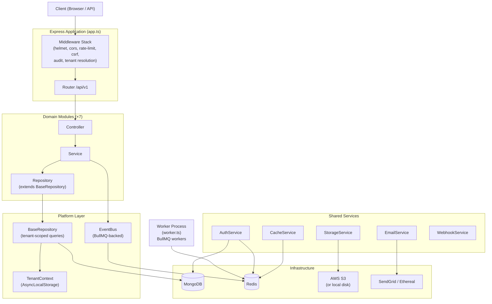

# Secom Backend — Architecture Overview
## Part 3: Configuration Management, Architecture & Design Patterns, Recommendations

---

## 6. Configuration & Environment Management

### 6.1 Environment Variable Inventory

All variables are defined in `backend/.env.example` and validated at startup by `src/config/env.ts` using a Zod schema.

| Variable | Required | Default | Production Constraint |
|---|---|---|---|
| `NODE_ENV` | No | `development` | — |
| `PORT` | No | `5000` | — |
| `DATABASE_URL` | **Yes** | — | Must be valid MongoDB URI |
| `REDIS_URL` | No | `redis://localhost:6379` | — |
| `REDIS_HOST` | No | `localhost` | — |
| `REDIS_PORT` | No | `6379` | — |
| `JWT_SECRET` | **Yes** | — | Min 64 chars |
| `JWT_REFRESH_SECRET` | **Yes** | — | Min 64 chars |
| `PORTAL_JWT_SECRET` | **Yes** | — | Min 64 chars |
| `CSRF_SECRET` | **Yes** | — | Min 32 chars |
| `FRONTEND_URL` | **Yes** | — | Must be valid URL |
| `ACCESS_TOKEN_EXPIRES` | No | `15m` | — |
| `REFRESH_TOKEN_EXPIRES_DAYS` | No | `7` | — |
| `MAX_REFRESH_TOKENS_PER_USER` | No | `5` | — |
| `PORTAL_ACCESS_TOKEN_EXPIRES` | No | `15m` | — |
| `PORTAL_REFRESH_TOKEN_EXPIRES_DAYS` | No | `7` | — |
| `FROM_EMAIL` | No | `noreply@secom.gov.br` | — |
| `ADMIN_EMAIL` | No | `admin@secom.gov.br` | — |
| `MOCK_EMAIL_SERVICE` | No | `false` | — |
| `ETHEREAL_USER` | No | — | Dev email testing |
| `ETHEREAL_PASS` | No | — | Dev email testing |
| `SENDGRID_API_KEY` | No* | — | *Required in production; must start with `SG.` |
| `AWS_REGION` | No | `''` | — |
| `AWS_S3_BUCKET` | No | `''` | Required for S3 storage in production |
| `AWS_ACCESS_KEY_ID` | No | `''` | — |
| `AWS_SECRET_ACCESS_KEY` | No | `''` | — |
| `LOG_LEVEL` | No | `info` | — |
| `ENABLE_REQUEST_LOGGING` | No | `true` | — |
| `DETAILED_ERRORS` | No | `false` | Should be `false` in production |
| `COOKIE_SECURE` | No | `false` | Should be `true` in production |
| `TRUST_PROXY` | No | `0` | Set to `1` behind a reverse proxy |
| `VERIFY_USER_ON_REQUEST` | No | `true` | — |
| `API_RATE_LIMIT_WINDOW_MS` | No | `900000` (15m) | — |
| `API_RATE_LIMIT_MAX` | No | `100` | — |
| `CONTACT_RATE_LIMIT_WINDOW_MS` | No | `900000` | — |
| `CONTACT_RATE_LIMIT_MAX` | No | `5` | — |
| `SENTRY_DSN` | No | — | Monitoring disabled if absent |
| `DEFAULT_ADMIN_PASSWORD` | No* | — | *Required on first run for seed |
| `AUDIT_LOG_TTL_DAYS` | No | `90` | Used by migration and cleanup queue |
| `ADMIN_URL` | No | — | Additional CORS origin |
| `MOBILE_URL` | No | — | Additional CORS origin |

### 6.2 Configuration Architecture

The configuration system follows a **validate-at-startup, typed-export** pattern:

```
process.env
    │
    ▼
envSchema.safeParse()   ← Zod schema (src/config/env.ts)
    │
    ├── Failure → throw Error with all validation messages → process exits
    │
    └── Success → typed `env` object exported
                      │
                      ▼
              Consumed by all modules
              (never reads process.env directly)
```

This is a strong pattern. All consumers import `env` from `config/env`, not `process.env` directly, which means:
- Type safety is enforced at compile time
- Missing variables cause a clear startup failure with a descriptive message
- Configuration is centralized and auditable

**Production-specific validation** is applied via `superRefine`: secret lengths, MongoDB URI format, SendGrid key format, and FRONTEND_URL format are all enforced when `NODE_ENV=production`.

### 6.3 Environment Separation

| Concern | Development | Test | Production |
|---|---|---|---|
| Database | Local MongoDB | `mongodb-memory-server` | External MongoDB (URI via env) |
| Redis | Local Redis | `ioredis-mock` (partial) | External Redis |
| Email | Mock or Ethereal | Mock (forced) | SendGrid |
| Storage | Local disk (`uploads/`) | Local disk | AWS S3 |
| Logging | `pino-pretty` (colorized) | Suppressed | JSON to stdout |
| CSRF cookie | `x-csrf-token` | Bypassed | `__Host-psifi.x-csrf-token` |
| Rate limits | Relaxed (1000 req/window) | — | Enforced (100 req/window) |
| Error details | Stack trace in response | — | Message only |
| BullMQ workers | Active | Null (no-op) | Active |

**Observation:** The test environment isolation is well-implemented. BullMQ workers are conditionally disabled, MongoDB uses an in-memory server, and CSRF is bypassed. This allows integration tests to run without any external infrastructure.

### 6.4 Secrets Management

**Current approach:** Secrets are loaded from `.env` files via `dotenv`. No secrets manager (AWS Secrets Manager, HashiCorp Vault, etc.) integration is present.

**Risk assessment:**
- 🟧 The `.env` file in `backend/` is present in the repository (visible in the directory listing). If this file contains real secrets and is committed to version control, it represents a critical security risk. The `.gitignore` should be verified to confirm `.env` is excluded.
- 🟩 The `.env.example` file correctly uses placeholder values and documents all required variables.
- 🟩 The Zod schema enforces minimum secret lengths, preventing weak secrets from being used.

### 6.5 Configuration Risks

| Risk | Severity | Detail |
|---|---|---|
| No secrets manager | 🟧 High | Secrets in `.env` files; no rotation mechanism |
| `VERIFY_USER_ON_REQUEST=false` in `.env.example` | 🟧 High | The example config disables per-request user status verification. If copied verbatim to production, deactivated users retain valid sessions until token expiry |
| `DETAILED_ERRORS=true` in `.env.example` | 🟨 Medium | Stack traces would be exposed in responses if this value is used in production |
| `COOKIE_SECURE=false` in `.env.example` | 🟨 Medium | Auth cookies would be transmitted over HTTP in production if not overridden |
| `AUDIT_LOG_TTL_DAYS` not in Zod schema | 🟨 Medium | This variable is read directly via `process.env` in `AuditLog.ts` and `auditCleanupQueue.ts`, bypassing the validated `env` object |
| No staging environment config | 🟨 Medium | No `.env.staging` or staging-specific validation rules observed |

---

## 7. Architecture & Design Patterns

### 7.1 Overall Architecture Style

The backend is a **modular monolith** with a clear two-layer structure:

```
┌─────────────────────────────────────────────────────────────┐
│                      HTTP Layer (Express)                    │
│  Routes → Middleware Stack → Controllers                     │
└──────────────────────────┬──────────────────────────────────┘
                           │
┌──────────────────────────▼──────────────────────────────────┐
│                    Domain Modules Layer                      │
│  /modules/domain/<entity>/                                   │
│  Controller → Service → Repository → Mongoose Model         │
└──────────────────────────┬──────────────────────────────────┘
                           │
┌──────────────────────────▼──────────────────────────────────┐
│                      Platform Layer                          │
│  BaseRepository  │  TenantContext  │  EventBus               │
│  TenantService   │  CacheService   │  StorageService         │
└──────────────────┬──────────────────────────────────────────┘
                   │
        ┌──────────┴──────────┐
        │                     │
   ┌────▼─────┐         ┌─────▼─────┐
   │ MongoDB  │         │   Redis   │
   └──────────┘         └───────────┘
```

### 7.2 Architecture Diagram (Mermaid)



### 7.3 Design Patterns in Use

#### Repository Pattern
Every domain module has a dedicated repository class that extends `BaseRepository<T>`. The base class provides generic CRUD, pagination, soft-delete, and existence checks. Domain repositories add filter-specific query methods (e.g., `findWithFilters`). This cleanly separates query construction from business logic.

**Tenant isolation is enforced at this layer** — `BaseRepository.mergeFilter()` automatically appends `tenantId` from `TenantContext` to every query. A service cannot accidentally query across tenants.

#### Service Layer Pattern
Services contain all business logic and orchestrate repositories, event emission, and external service calls. Controllers are intentionally thin — they extract request data, call the service, and return the response. Services have no knowledge of HTTP.

#### Middleware Chain Pattern
Express middleware is used extensively as a composable pipeline. Cross-cutting concerns (auth, rate limiting, CSRF, audit logging, response normalization, tenant resolution) are all implemented as middleware, keeping route handlers focused on business logic.

#### Abstract Base Class (Template Method)
`BaseAuthMiddleware` defines the authentication flow (extract token → verify → attach user) as a template, with abstract methods for token extraction and verification. `StaffAuthMiddleware` extends it for staff JWT auth. This allows a portal/citizen auth variant to be added without duplicating the auth flow.

#### Adapter Pattern
`StorageService` uses an internal `StorageAdapter` interface with two implementations: `LocalAdapter` (disk) and `S3Adapter`. The active adapter is selected at startup based on environment. Call sites are unaware of the underlying storage mechanism.

`EmailService` similarly supports three transport modes (SendGrid, Ethereal, stream) behind a single `sendEmail` interface.

#### Event-Driven Pattern (Domain Events)
Domain modules emit typed events via `eventBus.emit()` after state-changing operations. The event bus is backed by BullMQ in production (durable, Redis-persisted) and dispatches in-process in tests. Event listeners are registered at worker startup. This decouples side effects (email notifications, audit entries) from the primary business operation.

#### Singleton Pattern
`eventBus`, `redisClient`, `logger`, `authService`, `tenantService`, `emailService`, `storageService`, `webhookService`, and `auditService` are all module-level singletons. This is idiomatic in Node.js and appropriate for stateless services.

#### Mixin Pattern
Mongoose schema mixins (`authMixin`, `auditableMixin`, `tenantScopedMixin`) compose reusable field sets and methods into models without inheritance. This avoids deep schema inheritance chains.

### 7.4 Multi-Tenancy Implementation

The multi-tenancy model is **shared database, shared collections** with row-level isolation via `tenantId`. This is the most common approach for SaaS applications and is correctly implemented here.

The isolation chain is:

```
HTTP Request
    │
    ▼
resolveTenant middleware     ← Resolves tenant from JWT / header / subdomain
    │
    ▼
setTenantContext middleware   ← Stores tenantId in AsyncLocalStorage
    │
    ▼
Route Handler → Service → Repository
                               │
                               ▼
                    BaseRepository.mergeFilter()
                               │
                               ▼
                    { ...userFilter, tenantId }  ← Injected automatically
                               │
                               ▼
                           MongoDB Query
```

**Strengths:**
- Tenant isolation is enforced structurally, not by convention. A developer cannot forget to add `tenantId` to a query — the base repository does it automatically.
- `applyTenantAware` hook prevents `tenantId` from being changed after document creation.
- `ensureTenantAccess` middleware provides an additional HTTP-layer check for routes that accept a `tenantId` parameter.

**Risks:**
- 🟥 `DashboardService` calls `TenantContext.requireTenantId()` directly and constructs raw Mongoose queries with `{ tenantId }` — bypassing `BaseRepository`. If this pattern spreads, the isolation guarantee weakens.
- 🟧 `TenantService` methods (`findById`, `list`, `update`, etc.) query the `Tenant` collection directly without going through `BaseRepository`, which is correct (tenants are not tenant-scoped), but the pattern is inconsistent with domain modules and could confuse new developers.
- 🟧 No database-level enforcement (e.g., MongoDB views or field-level encryption per tenant). Isolation relies entirely on application-layer correctness.

### 7.5 RBAC Implementation

The RBAC system is **flat role-based** with a permission registry:

```
UserRole (6 roles)
    │
    ▼
ROLE_PERMISSIONS registry    ← Static mapping: role → Permission[]
    │
    ▼
hasPermission() / hasAnyPermission() / hasAllPermissions()
    │
    ▼
authorizeWithPermissions() middleware  ← Applied per route
```

**Roles and hierarchy:**

| Role | Hierarchy Level | Scope |
|---|---|---|
| `super_admin` | 100 | Platform-wide; bypasses all permission checks |
| `admin` | 80 | Full tenant access |
| `assessor` | 60 | Press, media, clipping, events |
| `social_media` | 50 | Social media, read-only press/events/clipping |
| `atendente` | 40 | Appointments, citizen portal, events (read) |
| `citizen` | 10 | Own appointments, citizen portal (read), events (read) |

**Strengths:**
- Permissions are granular (`resource:action` format) and consistently applied at the route level.
- `super_admin` role cannot be assigned via application code (enforced by a Mongoose pre-save hook).
- Authorization failures are logged to the audit trail.

**Risks:**
- 🟨 Two authorization mechanisms coexist: `authorize(...roles)` (role-based) and `authorizeWithPermissions({ permissions })` (permission-based). Some routes use one, some use the other. This inconsistency makes it harder to audit access control.
- 🟨 The RBAC registry is static (compile-time). There is no mechanism for runtime permission customization per tenant (e.g., a tenant disabling a feature for their users).

### 7.6 Dependency Direction & Coupling

```
routes/v1/index.ts
    │
    ├── modules/domain/*         (domain modules)
    │       └── platform/        (base repository, event bus, tenant context)
    │               └── models/  (shared models)
    │
    ├── services/auth/           (auth service)
    │       └── platform/        (event bus, tenant service)
    │
    └── services/admin/          (dashboard, audit, user)
            └── modules/domain/* ← ⚠️ Reverse dependency
```

The `DashboardService` in `services/admin/` imports Mongoose models directly from `modules/domain/*/models/`. This is a **reverse dependency** — a shared service layer depending on domain modules. The correct direction would be for domain modules to expose aggregation methods that the dashboard service calls, or for the dashboard to use a dedicated query layer.

### 7.7 Dependency Injection

There is **no DI container**. Dependencies are resolved via:
- Module-level singletons (most services)
- Constructor instantiation within service classes (`new PressReleaseRepository()` inside `PressReleaseService`)
- Direct imports

This is pragmatic for a monolith of this size but has implications for testability: unit tests must mock modules at the Jest module level (`jest.mock(...)`) rather than injecting mock dependencies through constructors. The existing unit tests demonstrate this pattern correctly.

### 7.8 Testability Assessment

| Layer | Testability | Notes |
|---|---|---|
| Controllers | High | Thin; easily tested via supertest integration tests |
| Services | Medium | Constructor-injected repositories would improve unit testability; currently requires `jest.mock` |
| Repositories | High | Extend `BaseRepository`; testable with `mongodb-memory-server` |
| Middleware | High | Pure functions; easily unit-tested |
| Platform (EventBus, TenantContext) | High | In-process mode in tests; `AsyncLocalStorage` works in test environment |

---

## 8. Initial High-Level Recommendations

### 🟥 Critical

**C1 — Verify `.env` is excluded from version control**
The `backend/.env` file appears in the directory listing. Confirm it is listed in `.gitignore` and has never been committed with real secrets. If it has been committed, rotate all secrets immediately.

**C2 — Add database transactions for multi-step writes**
`TenantService.create()` creates a `User` and a `Tenant` in two separate MongoDB operations with no transaction. If the second operation fails, an orphaned user record is left in the database. MongoDB 4.0+ supports multi-document transactions with Mongoose. All operations that write to multiple collections should be wrapped in a session transaction.

### 🟧 High

**H1 — Fix the reverse dependency in `DashboardService`**
`services/admin/dashboardService.ts` imports Mongoose models directly from `modules/domain/*/models/`. This violates the intended dependency direction. Domain modules should expose aggregation or summary methods, or a dedicated read model should be introduced for dashboard queries.

**H2 — Standardize authorization middleware**
Two authorization mechanisms (`authorize` and `authorizeWithPermissions`) are used inconsistently across routes. Standardize on `authorizeWithPermissions` with explicit permission checks for all protected routes. Remove `authorize` or restrict it to a single, documented use case.

**H3 — Add retry/durability to webhook delivery**
`WebhookService.deliver()` makes a single HTTP call with a 10-second timeout. There is no retry on failure, no dead-letter queue, and no delivery status tracking. Failed webhooks are only logged. For a production webhook system, delivery attempts should be queued via BullMQ with retry logic and stored delivery status.

**H4 — Move `AUDIT_LOG_TTL_DAYS` into the validated `env` object**
This variable is read directly from `process.env` in two places (`AuditLog.ts` and `auditCleanupQueue.ts`), bypassing the Zod-validated `env` object. Add it to `config/env.ts` to ensure it is validated and typed.

**H5 — Expand test coverage**
Only one domain module (`press-releases`) has a unit test. Integration test directories for most modules are empty. At minimum, each service layer should have unit tests covering the primary CRUD operations and error paths. The existing test infrastructure (`mongodb-memory-server`, `ioredis-mock`) is already in place.

### 🟨 Medium

**M1 — Resolve or remove `isomorphic-dompurify`**
Either apply it to user-generated HTML content before persistence, or remove it from `package.json`. An unused security library creates a false sense of protection.

**M2 — Complete or remove the MFA feature**
The `mfaEnabled` flag on the User model and `otplib` dependency suggest an incomplete feature. Either implement the enrollment/verification/recovery flow or remove the fields and dependency to avoid confusion.

**M3 — Extract the CSRF skip list to a constant**
The hardcoded array of paths that bypass CSRF protection in `app.ts` should be extracted to a named constant in `config/` or `constants/` for visibility and maintainability.

**M4 — Move auth route handlers to a controller**
`routes/auth.ts` contains 300 LOC of inline async handler logic, inconsistent with the controller pattern used by all domain modules. Extract handlers to `controllers/auth.controller.ts`.

**M5 — Address `VERIFY_USER_ON_REQUEST=false` in `.env.example`**
The example configuration disables per-request user status verification. This means deactivated users retain access until their token expires (up to 15 minutes). The example should set this to `true` with a comment explaining the Redis caching behavior and performance trade-off.

### 🟩 Low

**L1 — Remove redundant `dotenv.config()` calls**
`dotenv.config()` is called in `app.ts`, `config/database/redis.ts`, and `config/env.ts`. Since `server.ts` imports `config/env.ts` first, subsequent calls are no-ops. Remove them for clarity.

**L2 — Upgrade ESLint to v9 and `@typescript-eslint` to v8**
Both are in maintenance mode. The upgrade enables stricter type-aware linting rules that can catch additional issues at development time.

**L3 — Consider Zod v4 migration**
Zod v4 offers performance improvements and a smaller bundle. The migration path is straightforward given the consistent usage patterns in this codebase.

**L4 — Add `PORTAL_JWT_SECRET` usage documentation**
Three JWT secrets are defined (`JWT_SECRET`, `JWT_REFRESH_SECRET`, `PORTAL_JWT_SECRET`). The portal secret is validated in `env.ts` but its usage in a citizen portal auth flow was not observed in the current routes. Document its intended use or implement the portal auth flow.

---

*Document generated from static analysis of the secomvsaas backend codebase. All findings are based on observable code and configuration. No runtime behavior was assumed.*
