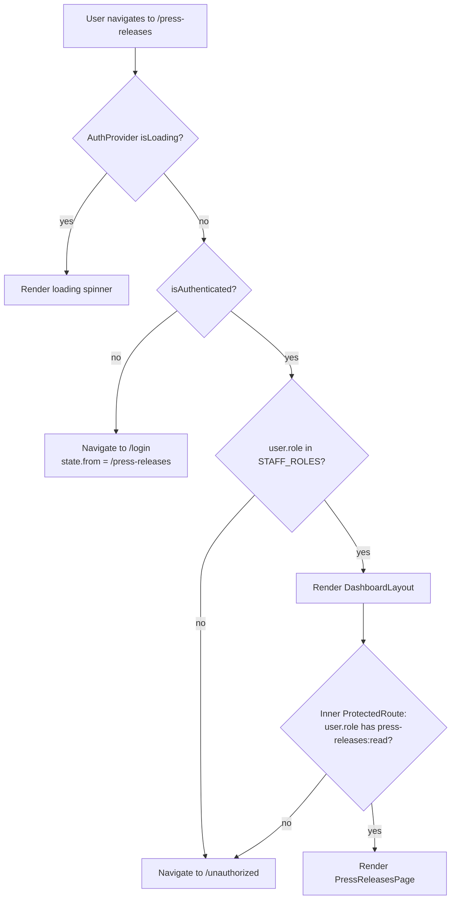
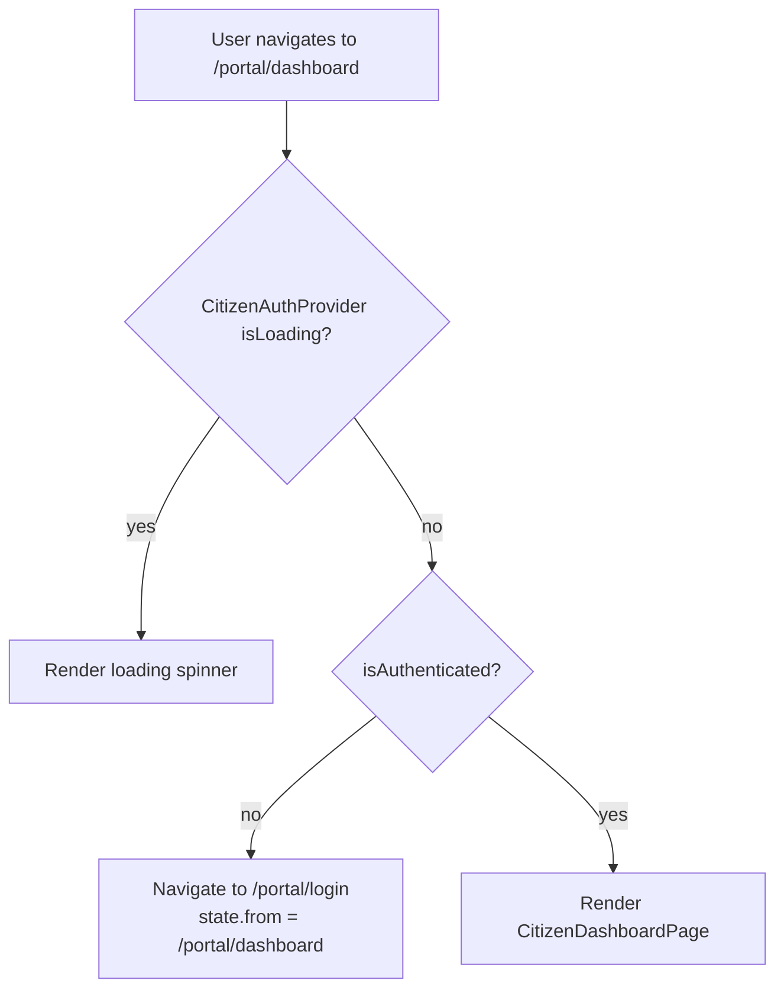

# Frontend Navigation & User Flows — Part 1
**Secom vSaaS · Routing Architecture, Authorization & Permission Matrix**

> Scope: static analysis of `src/routes/`, `src/components/Auth/`, `src/contexts/`, `src/layouts/`, `src/pages/`, `src/providers/`, `packages/types/src/index.ts`.
> All findings are grounded in observable code. Assumptions are explicitly marked.

---

## 1. Executive Summary

| Dimension | Assessment |
|---|---|
| Routing maturity | Solid — single declarative file, clear layout nesting, full lazy-loading |
| Authorization robustness | Adequate — dual-context model (staff / citizen) with consistent guard placement; one structural gap (see §3.4) |
| RBAC scalability | Good — permission table is centralised in `@vsaas/types`; role-check logic is not scattered |
| Navigation architecture clarity | Good — sidebar driven by `PermissionGate`; mobile handled in `DashboardLayout` via Zustand |
| UX complexity | Low-to-medium — two independent auth flows increase cognitive surface for new contributors |
| Security risk profile | Low-medium — no token stored in `localStorage`; httpOnly cookies; CSRF interceptor present; one bypass vector identified |
| Maintainability | High — route file is ~80 LOC; permission matrix is a single `Record`; breadcrumbs are auto-generated |

The architecture is well-structured for its current scope. The primary risks are: (1) the outer `ProtectedRoute` wrapper on the dashboard layout group does not carry `allowedRoles`, creating a window where an authenticated `citizen` user could reach `/admin/dashboard` before the inner guard fires; (2) `NotFoundPage` hard-codes a redirect to `/admin/dashboard`, which is incorrect for citizen users; (3) the citizen portal has no session-timeout mechanism equivalent to the staff dashboard.

---

## 2. Routing Architecture

### 2.1 Route Tree

```
/ (BrowserRouter)
│
├── <PublicLayout>                          [no auth guard]
│   ├── /                                  LandingPage
│   ├── /privacy                           PrivacyPage
│   ├── /terms                             TermsPage
│   ├── /login                             LoginPage
│   ├── /register                          RegisterPage
│   ├── /accept-invite                     AcceptInvitePage
│   ├── /forgot-password                   ForgotPasswordPage
│   └── /reset-password                    ResetPasswordPage
│
├── <ProtectedRoute allowedRoles={STAFF_ROLES}>
│   └── <DashboardLayout>                  [staff auth guard — outer]
│       ├── /admin/dashboard               DashboardPage
│       ├── /admin/users                   ProtectedRoute[users:read] → UsersPage
│       ├── /settings/profile              ProfilePage              [no inner role guard]
│       ├── /press-releases                ProtectedRoute[press-releases:read] → PressReleasesPage
│       ├── /media-contacts                ProtectedRoute[media-contacts:read] → MediaContactsPage
│       ├── /clippings                     ProtectedRoute[clippings:read] → ClippingsPage
│       ├── /events                        ProtectedRoute[events:read] → EventsPage
│       ├── /appointments                  ProtectedRoute[appointments:read] → AppointmentsPage
│       ├── /citizen-portal                ProtectedRoute[citizen-portal:read] → CitizenRecordsPage
│       └── /social-media                  ProtectedRoute[social-media:read] → SocialMediaPage
│
├── <CitizenPortalLayout>                  [no auth guard on layout]
│   ├── /portal                            CitizenPortalHomePage    [public]
│   ├── /portal/login                      CitizenLoginPage         [public]
│   ├── /portal/register                   CitizenRegisterPage      [public]
│   ├── /portal/dashboard                  ProtectedCitizenRoute → CitizenDashboardPage
│   └── /portal/profile                    ProtectedCitizenRoute → CitizenProfilePage
│
├── /unauthorized                          UnauthorizedPage         [no layout]
└── *                                      NotFoundPage             [no layout]
```

**Observations:**
- There are no index routes (`<Route index />`). The root `/` is an explicit path under `PublicLayout`.
- There are no dynamic segment routes (`:id`). All domain pages use list/modal patterns — detail views are rendered inline via modals, not separate routes.
- `/unauthorized` and `*` (404) are orphan routes — they render without any layout wrapper.
- `AuthLayout` exists as a directory (`src/layouts/AuthLayout/`) but is **not used** in the route tree. Auth pages are served under `PublicLayout`.

### 2.2 Route Metrics

| Metric | Count | Notes |
|---|---|---|
| Total routes | 25 | Counting each `<Route path=...>` leaf |
| Public routes | 11 | Under `PublicLayout` + `/portal` + `/portal/login` + `/portal/register` + `/unauthorized` + `*` |
| Protected routes (staff) | 10 | Under outer `ProtectedRoute(STAFF_ROLES)` |
| Protected routes (citizen) | 2 | `/portal/dashboard`, `/portal/profile` |
| Role-restricted routes (inner guard) | 8 | All domain modules + `/admin/users` |
| Dynamic routes (`:param`) | 0 | None — detail views are modal-based |
| Lazy-loaded routes | 23 | All page components use `React.lazy` |
| Layout wrappers | 3 | `PublicLayout`, `DashboardLayout`, `CitizenPortalLayout` |
| Orphan routes (no layout) | 2 | `/unauthorized`, `*` |
| Unused layout components | 1 | `AuthLayout` |

### 2.3 Route Classification Table

| Path | Component | Visibility | Roles | Lazy | Layout | Notes |
|---|---|---|---|---|---|---|
| `/` | `LandingPage` | Public | All | ✓ | PublicLayout | Marketing landing |
| `/privacy` | `PrivacyPage` | Public | All | ✓ | PublicLayout | |
| `/terms` | `TermsPage` | Public | All | ✓ | PublicLayout | |
| `/login` | `LoginPage` | Public | All | ✓ | PublicLayout | Redirects to `/admin/dashboard` on success |
| `/register` | `RegisterPage` | Public | All | ✓ | PublicLayout | Creates tenant + admin user |
| `/accept-invite` | `AcceptInvitePage` | Public | All | ✓ | PublicLayout | Token via `?token=` query param |
| `/forgot-password` | `ForgotPasswordPage` | Public | All | ✓ | PublicLayout | |
| `/reset-password` | `ResetPasswordPage` | Public | All | ✓ | PublicLayout | Token via `?token=` query param |
| `/admin/dashboard` | `DashboardPage` | Protected | STAFF_ROLES | ✓ | DashboardLayout | No inner role guard |
| `/admin/users` | `UsersPage` | Protected | `users:read` → admin, super_admin | ✓ | DashboardLayout | Double-guarded |
| `/settings/profile` | `ProfilePage` | Protected | STAFF_ROLES (outer only) | ✓ | DashboardLayout | No inner role guard |
| `/press-releases` | `PressReleasesPage` | Protected | `press-releases:read` | ✓ | DashboardLayout | |
| `/media-contacts` | `MediaContactsPage` | Protected | `media-contacts:read` | ✓ | DashboardLayout | |
| `/clippings` | `ClippingsPage` | Protected | `clippings:read` | ✓ | DashboardLayout | |
| `/events` | `EventsPage` | Protected | `events:read` | ✓ | DashboardLayout | |
| `/appointments` | `AppointmentsPage` | Protected | `appointments:read` | ✓ | DashboardLayout | |
| `/citizen-portal` | `CitizenRecordsPage` | Protected | `citizen-portal:read` | ✓ | DashboardLayout | Staff view of citizen records |
| `/social-media` | `SocialMediaPage` | Protected | `social-media:read` | ✓ | DashboardLayout | |
| `/portal` | `CitizenPortalHomePage` | Public | All | ✓ | CitizenPortalLayout | |
| `/portal/login` | `CitizenLoginPage` | Public | All | ✓ | CitizenPortalLayout | Respects `location.state.from` |
| `/portal/register` | `CitizenRegisterPage` | Public | All | ✓ | CitizenPortalLayout | |
| `/portal/dashboard` | `CitizenDashboardPage` | Protected | citizen (CitizenAuth) | ✓ | CitizenPortalLayout | |
| `/portal/profile` | `CitizenProfilePage` | Protected | citizen (CitizenAuth) | ✓ | CitizenPortalLayout | |
| `/unauthorized` | `UnauthorizedPage` | Public | All | ✓ | None | 403 page |
| `*` | `NotFoundPage` | Public | All | ✓ | None | 404 page |

### 2.4 Layout Composition

```
AppProviders
  └── BrowserRouter
        └── App
              ├── ErrorBoundary (global)
              ├── TopLoadingBar
              ├── ScrollToTop
              ├── ConnectionBanner
              ├── AppRoutes
              │     ├── PublicLayout → MainHeader + Footer + <Outlet>
              │     ├── ProtectedRoute(STAFF_ROLES) → DashboardLayout
              │     │     └── Sidebar + Breadcrumbs + ErrorBoundary + <Outlet>
              │     └── CitizenPortalLayout → Header + Footer + <Outlet>
              ├── CookieConsent
              └── ToastContainer
```

**Provider nesting order** (from `AppProviders.tsx`):
1. `QueryProvider` (TanStack Query)
2. `BrowserRouter`
3. `AuthProvider` (staff session — httpOnly cookie, `/api/v1/auth/me` on mount)
4. `CitizenAuthProvider` (citizen session — httpOnly cookie, `/api/v1/citizen-auth/me` on mount)
5. `TenantProvider` (enabled only when `isAuthenticated && user.tenantId`)

---

## 3. Protected Routes & Authorization Architecture

### 3.1 Authentication Detection

Both auth contexts follow the same pattern:

```
Mount → call /me endpoint → setUser(res.data) or setUser(null) → setIsLoading(false)
```

`isAuthenticated` is derived as `!!user` — a truthy check on the user object. There is no token stored in `localStorage` or `sessionStorage`; session state lives in httpOnly cookies managed by the backend.

**Token refresh flow** (in `src/services/interceptors/index.ts`):
1. Any non-auth API call that returns `401` triggers a single shared `refreshPromise` (deduplication guard present).
2. Refresh calls `POST /api/v1/auth/refresh` with `credentials: 'include'`.
3. On success, the original request is retried once (`_retry` flag).
4. On refresh failure, the original `401` is re-thrown — the caller (React Query) surfaces the error; no automatic redirect to `/login` occurs at the interceptor level.

**CSRF protection:**
- `GET` and `HEAD` requests skip CSRF.
- Auth endpoints (`/api/v1/auth/`, citizen auth, CSRF token endpoint) are explicitly excluded.
- All other mutating requests fetch a CSRF token from `/api/csrf-token` and attach it as `X-CSRF-Token`.
- On `403 INVALID_CSRF_TOKEN`, the token is invalidated and re-fetched once before retrying.

### 3.2 Role Resolution Logic

Role is stored on the `User` object returned by `/api/v1/auth/me`. It is a single string (`UserRoleType`). There is no client-side role elevation or multi-role support.

`rolesWithPermission(permission)` (from `@vsaas/types`) computes the allowed role list at import time by iterating `ROLE_PERMISSIONS`. This is called inline in the route definition:

```tsx
<ProtectedRoute allowedRoles={rolesWithPermission('press-releases:read')}>
```

This means the allowed-roles array is computed once at module load, not per render.

### 3.3 Authorization Enforcement Locations

| Layer | Mechanism | Scope |
|---|---|---|
| Route (outer) | `ProtectedRoute(STAFF_ROLES)` wrapping `DashboardLayout` | Blocks all non-staff from the entire dashboard subtree |
| Route (inner) | `ProtectedRoute(rolesWithPermission(...))` per domain route | Restricts specific modules by permission |
| Navigation UI | `PermissionGate` in `DashboardLayout` sidebar | Hides nav links the user cannot access |
| Component | `PermissionGate` used ad-hoc (e.g., sidebar only) | Not observed at page-content level |
| API | Backend RBAC (out of scope for this document) | Server-side enforcement |

### 3.4 Authorization Flow — Staff



### 3.5 Authorization Flow — Citizen



Note: `ProtectedCitizenRoute` does **not** check a role — it only checks `isAuthenticated` from `CitizenAuthContext`. The citizen role is enforced by the separate auth context, not by a role comparison.

### 3.6 Redirect Behaviour Summary

| Trigger | Redirect Target | Preserves `from`? |
|---|---|---|
| Unauthenticated staff accessing protected route | `/login` | ✓ (`state.from`) |
| Authenticated staff with wrong role | `/unauthorized` | ✗ |
| Unauthenticated citizen accessing `/portal/dashboard` | `/portal/login` | ✓ (`state.from`) |
| Login success (staff) | `/admin/dashboard` | ✗ (hard-coded) |
| Login success (citizen) | `state.from` or `/portal/dashboard` | ✓ |
| Accept-invite success | `/admin/dashboard` | ✗ (hard-coded) |
| Register success | `/admin/dashboard` | ✗ (hard-coded) |
| 404 page "back to home" button | `/admin/dashboard` | N/A |

### 3.7 Session Management

- **Inactivity timeout:** 30 minutes, with a 2-minute warning modal (`useSessionTimeout` in `DashboardLayout`).
- **Events that reset the timer:** `mousedown`, `keydown`, `scroll`, `touchstart`.
- **On timeout:** `logout()` is called, then `navigate('/login')`.
- **Citizen portal:** No equivalent session timeout mechanism. `CitizenPortalLayout` does not use `useSessionTimeout`.

### 3.8 Risk Table — Authorization

| Issue | Severity | Evidence | Impact | Scope |
|---|---|---|---|---|
| Outer `ProtectedRoute` on dashboard group has no `allowedRoles` — it uses `STAFF_ROLES` but the `citizen` role is excluded from `STAFF_ROLES`, so this is actually correct. However, the guard is on the **wrapper element**, not the layout itself — if `DashboardLayout` is rendered as the `element` prop of the outer `Route`, a `citizen` user is blocked before reaching the layout. This is correct behaviour. | — | `routes/index.tsx` L52 | No bypass — confirmed safe | Dashboard group |
| `NotFoundPage` "back to home" button hard-codes `/admin/dashboard` | 🟧 High | `NotFoundPage.tsx` L10 | Citizen users hitting a 404 are directed to a staff route, triggering a second redirect to `/login` | Global |
| No session timeout for citizen portal | 🟧 High | `CitizenPortalLayout.tsx` — no `useSessionTimeout` | Citizen sessions persist indefinitely on inactive tabs | Citizen portal |
| Refresh failure does not trigger automatic logout/redirect | 🟨 Medium | `interceptors/index.ts` L47–52 | After token expiry, API calls fail silently; user sees error states rather than a clean re-authentication prompt | All protected routes |
| `AcceptInvitePage` calls `/api/v1/auth/accept-invite` directly via `http.post` without going through `authService` | 🟨 Medium | `AcceptInvitePage.tsx` L28 | Bypasses any future service-layer middleware; inconsistent with other auth flows | Accept-invite flow |
| `AuthLayout` component exists but is unused | 🟩 Low | `src/layouts/AuthLayout/` — not imported in routes | Dead code; potential confusion for new contributors | Codebase |
| `/settings/profile` has no inner role guard — accessible to all `STAFF_ROLES` | 🟩 Low | `routes/index.tsx` L56 | Intentional (all staff can view their profile), but undocumented | Profile route |

---

## 4. Permission Matrix

### 4.1 Role Definitions (from `@vsaas/types`)

| Role | Description |
|---|---|
| `super_admin` | All permissions |
| `admin` | All domain permissions + user/tenant management |
| `assessor` | Press releases, media contacts, clippings, events (read/write); reports (read) |
| `social_media` | Social media (read/write); press releases, events, clippings (read only) |
| `atendente` | Appointments (read/write); citizen portal (read/write); events (read) |
| `citizen` | Citizen auth context only — no access to staff dashboard |

### 4.2 Route Access Matrix

| Route | super_admin | admin | assessor | social_media | atendente | citizen |
|---|---|---|---|---|---|---|
| `/` | ✓ | ✓ | ✓ | ✓ | ✓ | ✓ |
| `/login` | ✓ | ✓ | ✓ | ✓ | ✓ | ✓ |
| `/register` | ✓ | ✓ | ✓ | ✓ | ✓ | ✓ |
| `/accept-invite` | ✓ | ✓ | ✓ | ✓ | ✓ | ✓ |
| `/forgot-password` | ✓ | ✓ | ✓ | ✓ | ✓ | ✓ |
| `/reset-password` | ✓ | ✓ | ✓ | ✓ | ✓ | ✓ |
| `/admin/dashboard` | ✓ | ✓ | ✓ | ✓ | ✓ | ✗ → `/unauthorized` |
| `/admin/users` | ✓ | ✓ | ✗ | ✗ | ✗ | ✗ |
| `/settings/profile` | ✓ | ✓ | ✓ | ✓ | ✓ | ✗ |
| `/press-releases` | ✓ | ✓ | ✓ | ✓ (read) | ✗ | ✗ |
| `/media-contacts` | ✓ | ✓ | ✓ | ✗ | ✗ | ✗ |
| `/clippings` | ✓ | ✓ | ✓ | ✓ (read) | ✗ | ✗ |
| `/events` | ✓ | ✓ | ✓ | ✓ (read) | ✓ (read) | ✗ |
| `/appointments` | ✓ | ✓ | ✗ | ✗ | ✓ | ✗ |
| `/citizen-portal` | ✓ | ✓ | ✗ | ✗ | ✓ | ✗ |
| `/social-media` | ✓ | ✓ | ✗ | ✓ | ✗ | ✗ |
| `/portal` | ✓ | ✓ | ✓ | ✓ | ✓ | ✓ |
| `/portal/login` | ✓ | ✓ | ✓ | ✓ | ✓ | ✓ |
| `/portal/register` | ✓ | ✓ | ✓ | ✓ | ✓ | ✓ |
| `/portal/dashboard` | ✗¹ | ✗¹ | ✗¹ | ✗¹ | ✗¹ | ✓ |
| `/portal/profile` | ✗¹ | ✗¹ | ✗¹ | ✗¹ | ✗¹ | ✓ |

> ¹ Staff users are not blocked by a route guard from visiting `/portal/*` routes — `CitizenPortalLayout` has no auth guard. A staff user who navigates to `/portal/dashboard` will be redirected to `/portal/login` by `ProtectedCitizenRoute` because `CitizenAuthContext.isAuthenticated` is `false` for them. This is functionally correct but architecturally implicit.

### 4.3 Feature/Write Permission Matrix

| Feature | super_admin | admin | assessor | social_media | atendente | citizen |
|---|---|---|---|---|---|---|
| Create/edit press releases | ✓ | ✓ | ✓ | ✗ | ✗ | ✗ |
| Delete press releases | ✓ | ✓ | ✗ | ✗ | ✗ | ✗ |
| Create/edit media contacts | ✓ | ✓ | ✓ | ✗ | ✗ | ✗ |
| Delete media contacts | ✓ | ✓ | ✗ | ✗ | ✗ | ✗ |
| Create/edit clippings | ✓ | ✓ | ✓ | ✗ | ✗ | ✗ |
| Create/edit events | ✓ | ✓ | ✓ | ✗ | ✗ | ✗ |
| Create/edit appointments | ✓ | ✓ | ✗ | ✗ | ✓ | ✗ |
| Create/edit citizen records | ✓ | ✓ | ✗ | ✗ | ✓ | ✗ |
| Create/edit social media posts | ✓ | ✓ | ✗ | ✓ | ✗ | ✗ |
| Invite/manage users | ✓ | ✓ | ✗ | ✗ | ✗ | ✗ |
| View reports | ✓ | ✓ | ✓ | ✗ | ✗ | ✗ |

**Note:** Write-permission enforcement at the UI level is not observable in the route layer. The `CrudPage` component renders Edit/Delete buttons for all users who can reach the page. Write-permission differentiation (e.g., hiding the "Delete" button for `assessor`) is **not implemented** in the frontend — it is enforced only at the API level.

### 4.4 Navigation Visibility Matrix (Sidebar)

The sidebar uses `PermissionGate` with `permissions` arrays. Visibility is determined by `hasAnyPermission(user.role, permissions)`.

| Nav Item | super_admin | admin | assessor | social_media | atendente |
|---|---|---|---|---|---|
| Dashboard | ✓ | ✓ | ✓ | ✓ | ✓ |
| Users | ✓ | ✓ | ✗ | ✗ | ✗ |
| Profile | ✓ | ✓ | ✓ | ✓ | ✓ |
| Comunicados | ✓ | ✓ | ✓ | ✓ | ✗ |
| Contatos de Mídia | ✓ | ✓ | ✓ | ✗ | ✗ |
| Clipping | ✓ | ✓ | ✓ | ✓ | ✗ |
| Eventos | ✓ | ✓ | ✓ | ✓ | ✓ |
| Agendamentos | ✓ | ✓ | ✗ | ✗ | ✓ |
| Portal do Cidadão | ✓ | ✓ | ✗ | ✗ | ✓ |
| Redes Sociais | ✓ | ✓ | ✗ | ✓ | ✗ |

Navigation visibility is **consistent** with route-level access — a user who cannot reach a route will also not see it in the sidebar.

### 4.5 RBAC Design Observations

- Permission strings follow a consistent `resource:action` pattern (`press-releases:read`, `users:write`, etc.).
- `ROLE_PERMISSIONS` is a flat `Record<Role, Permission[]>` — no permission inheritance or role hierarchy.
- `super_admin` is granted all permissions via `Object.values(PERMISSIONS)`.
- `rolesWithPermission()` is a pure function — safe to call at module load time.
- Write/delete permissions are defined in the type system but **not used** by the frontend route guards. Only `:read` permissions gate route access. This is a deliberate design choice (read access = page access; write access = API-level enforcement).
- The `citizen` role appears in `ROLE_PERMISSIONS` with `appointments:read/write` and `citizen-portal:read`, but these permissions are never evaluated in the staff routing system — the citizen role is excluded from `STAFF_ROLES` at the outer guard level.

---

*Continues in Part 2: Navigation Architecture, User Journey Maps, Conditional Routing Analysis, and Recommendations.*
