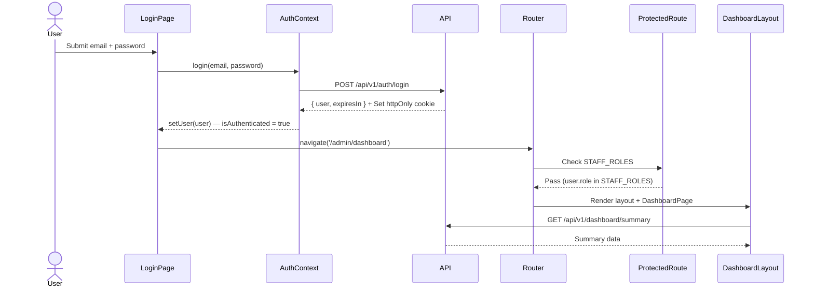
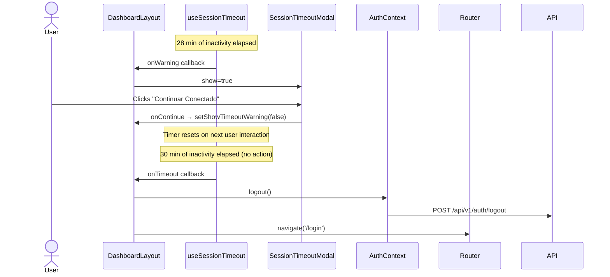
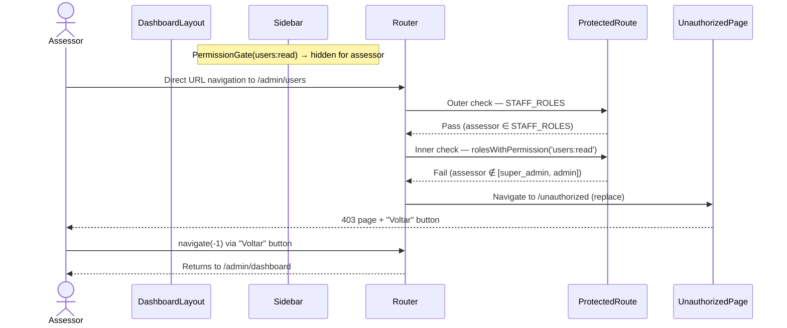
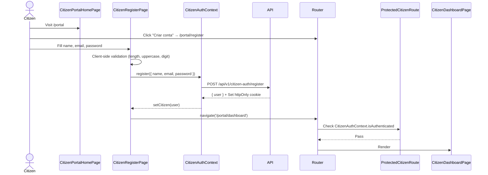
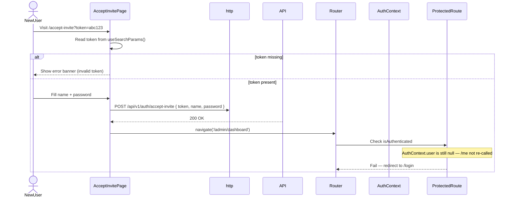
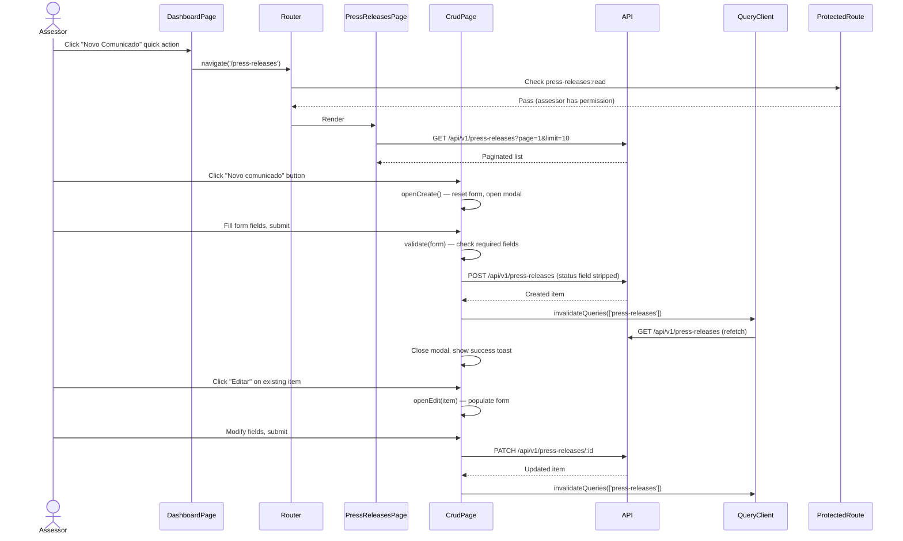
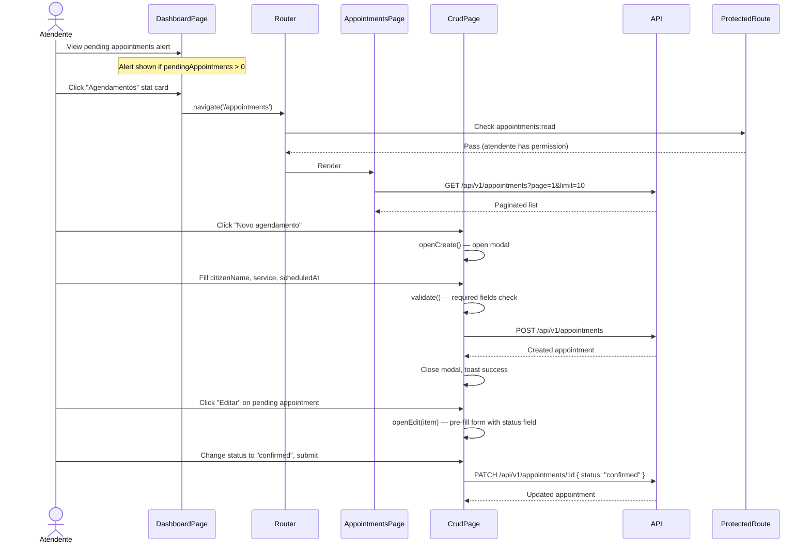

# Frontend Navigation & User Flows — Part 2
**Secom vSaaS · Navigation Architecture, User Journeys, Complexity Analysis & Recommendations**

> Continuation of `navigation-userflows-part-1.md`.
> All findings are grounded in observable code. Assumptions are explicitly marked.

---

## 5. Navigation Architecture

### 5.1 Desktop Navigation — Sidebar

The sidebar is rendered inside `DashboardLayout` and is only visible to authenticated staff users. It is not a separate component — it is inlined in the layout file.

**Structure (ASCII):**

```
┌─────────────────────────────────┐
│  [Logo]          [Toggle btn]   │  ← sidebarHeader
├─────────────────────────────────┤
│  🏠  Dashboard                  │  ← always visible (all STAFF_ROLES)
│  👥  Usuários                   │  ← PermissionGate: users:read
│  👤  Perfil                     │  ← always visible (all STAFF_ROLES)
│                                 │
│  — MÓDULOS —                    │  ← static section label
│  📰  Comunicados                │  ← PermissionGate: press-releases:read
│  📇  Contatos de Mídia          │  ← PermissionGate: media-contacts:read
│  ✂️  Clipping                   │  ← PermissionGate: clippings:read
│  📅  Eventos                    │  ← PermissionGate: events:read
│  🗓  Agendamentos               │  ← PermissionGate: appointments:read
│  🏛  Portal do Cidadão          │  ← PermissionGate: citizen-portal:read
│  📱  Redes Sociais              │  ← PermissionGate: social-media:read
├─────────────────────────────────┤
│  [user.name]       [Sair btn]   │  ← sidebarFooter
└─────────────────────────────────┘
```

**Collapsed state:** When `sidebarOpen = false` (Zustand `uiStore`), icon-only mode is active. Nav link labels are hidden; `title` attribute is set to the label string for tooltip accessibility.

**Active route detection:** Uses React Router's `NavLink` with a callback prop pattern:

```tsx
({ isActive }) => ({
  className: isActive ? `${styles.navLink} ${styles.navLinkActive}` : styles.navLink,
  'aria-current': isActive ? 'page' : undefined,
  title: !sidebarOpen ? label : undefined,
})
```

Active state is determined by React Router's default exact-match behaviour on `NavLink`.

**Permission gating:** Each module link is wrapped in `PermissionGate`, which calls `hasAnyPermission(user.role, permissions)` from `@vsaas/types`. The gate renders `null` (no fallback) when the user lacks the permission.

**Sidebar state persistence:** `sidebarOpen` lives in Zustand (`uiStore`) with no `localStorage` persistence — it resets to `true` on page reload.

### 5.2 Mobile Navigation — Dashboard

Mobile behaviour is handled entirely within `DashboardLayout` via CSS and a Zustand flag:

- On route change, if `window.innerWidth < 768`, `setSidebarOpen(false)` is called via a `useEffect` watching `location.pathname`.
- A full-screen overlay `div` (`.overlay`) is rendered behind the sidebar; clicking it calls `setSidebarOpen(false)`.
- There is no bottom navigation bar or drawer animation — the sidebar slides in/out via CSS class toggling (`styles.sidebarOpen` / `styles.sidebarClosed`).
- The toggle button in `sidebarHeader` is always visible and controls open/close on both desktop and mobile.

**Risk:** `window.innerWidth` is read directly inside a `useEffect` — this is not reactive to viewport resize events. If a user resizes the window while on a route, the sidebar auto-close logic will not re-evaluate until the next navigation.

### 5.3 Public Site Navigation — MainHeader

`MainHeader` is rendered inside `PublicLayout` and serves the landing/auth pages.

**Structure:**

```
┌──────────────────────────────────────────────────────┐
│  [Logo]   Funcionalidades  Módulos  LGPD  Contato    │
│                              [Entrar]  [Começar →]   │
└──────────────────────────────────────────────────────┘
```

- Nav links are anchor tags (`<a href="/#section">`) pointing to hash anchors on the landing page — not React Router `<Link>` components. This means they trigger a full scroll, not a client-side navigation.
- "Entrar" links to `/login`; "Começar" links to `/register` — both are React Router `<Link>`.
- Mobile: hamburger button toggles a dropdown menu (`mobileOpen` state). Closes on: route change, `Escape` key, outside click.
- No role-based variations — `MainHeader` has no access to `AuthContext`.

### 5.4 Citizen Portal Navigation — CitizenPortalLayout Header

The citizen portal header is inlined in `CitizenPortalLayout` and conditionally renders based on `CitizenAuthContext.isAuthenticated`:

```
Unauthenticated:          Authenticated:
┌──────────────────┐      ┌──────────────────────────────┐
│ 🏛 Portal        │      │ 🏛 Portal                    │
│  [Entrar]        │      │  [Início] [Meu perfil] [Sair]│
│  [Cadastrar]     │      │  Olá, {citizen.name}         │
└──────────────────┘      └──────────────────────────────┘
```

- No `NavLink` — uses plain `<Link>` with no active-state styling.
- No mobile drawer — the header is a simple flex row that wraps on small screens (CSS-only).
- Footer contains links to `/privacy`, `/terms`, and `/` (back to public site).

### 5.5 Breadcrumbs

Breadcrumbs are rendered inside `DashboardLayout` above the page content area, only for staff routes.

**Generation strategy:** Automatic, path-segment based via `generateBreadcrumbs(pathname, t)`:

1. Splits `pathname` by `/`.
2. Skips segments matching MongoDB ObjectId (`/^[a-f0-9]{24}$/i`) or UUID (`/^[0-9a-f-]{36}$/i`) patterns.
3. Looks up each segment in the i18n dictionary under `breadcrumbs.<segment>`.
4. Falls back to capitalising the raw segment if no translation key exists.
5. Renders nothing if the crumb array has ≤ 1 item (i.e., at root `/`).

**Example outputs:**

| Path | Breadcrumbs |
|---|---|
| `/admin/dashboard` | Início / Admin / Dashboard |
| `/press-releases` | Início / Comunicados |
| `/admin/users` | Início / Admin / Usuários |
| `/settings/profile` | Início / Settings / Profile |

**Observations:**
- Breadcrumbs accept an optional `items` prop for manual override — not used anywhere in the current codebase (all pages rely on auto-generation).
- The component injects a `schema.org BreadcrumbList` JSON-LD `<script>` tag for SEO.
- The component is `React.memo`-wrapped.
- Breadcrumbs are **not rendered** in `CitizenPortalLayout` or `PublicLayout`.

### 5.6 Navigation Risk Table

| Issue | Severity | Evidence | Impact | Scope |
|---|---|---|---|---|
| `window.innerWidth` read in `useEffect` is not reactive to resize | 🟨 Medium | `DashboardLayout.tsx` L35 | Sidebar may remain open after viewport resize without navigation | Mobile/tablet |
| Sidebar state (`sidebarOpen`) not persisted to `localStorage` | 🟩 Low | `uiStore.ts` — no persistence middleware | User preference resets on every page reload | Desktop |
| No active-state styling on citizen portal nav links | 🟩 Low | `CitizenPortalLayout.tsx` — plain `<Link>`, no `NavLink` | No visual indication of current page in citizen portal | Citizen portal |
| Public nav links use `<a href="/#section">` not `<Link>` | 🟩 Low | `MainHeader.tsx` L8–13 | Hash navigation works but bypasses React Router; inconsistent pattern | Public layout |
| No breadcrumbs in citizen portal | 🟩 Low | `CitizenPortalLayout.tsx` — no `<Breadcrumbs>` | Reduced wayfinding for citizen users | Citizen portal |
| `AuthLayout` directory exists but is unused | 🟩 Low | `src/layouts/AuthLayout/` — not imported anywhere | Dead code; onboarding confusion | Codebase |

---

## 6. User Journey Maps

### Journey 1 — Staff Authentication

| Attribute | Value |
|---|---|
| Role | Any staff (`admin`, `assessor`, `social_media`, `atendente`) |
| Business objective | Authenticate and reach the staff dashboard |
| Start route | `/login` |
| End route | `/admin/dashboard` |
| Complexity | Low |

**Sequence:**



**Step-by-step:**

1. User visits `/login` (under `PublicLayout`).
2. Submits credentials via `LoginForm`.
3. `AuthContext.login()` calls `POST /api/v1/auth/login`; on success sets `user` in context state.
4. `LoginPage` calls `navigate('/admin/dashboard')` — destination is hard-coded, ignoring any `state.from`.
5. `ProtectedRoute(STAFF_ROLES)` evaluates `user.role` — passes for all staff roles.
6. `DashboardLayout` renders; `useDashboard()` fires `GET /api/v1/dashboard/summary`.
7. `TenantProvider` fires `GET /api/v1/tenants/me` (enabled because `isAuthenticated && user.tenantId`).

**UX observations:**
- No post-login redirect to the originally requested URL — `state.from` is set by `ProtectedRoute` on redirect to `/login`, but `LoginPage` ignores it and always navigates to `/admin/dashboard`. A user who bookmarks `/press-releases` and is redirected to login will land on the dashboard, not their intended page.
- No "remember me" option — session lifetime is controlled entirely by the backend cookie TTL.
- Error messages are surfaced inline via `role="alert"` banner — accessible.

---

### Journey 2 — Staff Session Expiry & Re-authentication

| Attribute | Value |
|---|---|
| Role | Any staff |
| Business objective | Recover from session expiry without data loss |
| Start route | Any protected route (e.g., `/press-releases`) |
| End route | `/login` → `/admin/dashboard` |
| Complexity | Medium |

**Sequence:**



**Step-by-step:**

1. After 28 minutes of inactivity (`INACTIVITY_MS - WARNING_MS`), `useSessionTimeout` fires `onWarning`.
2. `DashboardLayout` sets `showTimeoutWarning = true`, rendering `SessionTimeoutModal`.
3. If user clicks "Continuar Conectado": modal closes, timer resets on next DOM event.
4. If user clicks "Sair" or takes no action for 2 more minutes: `handleLogout` is called.
5. `handleLogout` calls `AuthContext.logout()` → `POST /api/v1/auth/logout` → `setUser(null)`.
6. `navigate('/login')` is called — no `state.from` is preserved.

**UX observations:**
- The 2-minute warning window is reasonable. The modal blocks interaction (`closeOnOverlayClick={false}`, `showCloseButton={false}`), preventing accidental dismissal.
- After timeout logout, the user lands on `/login` with no indication of why they were logged out — no query param or toast message.
- Any unsaved form data (e.g., a draft press release in the modal) is lost on timeout logout. The `CrudPage` modal has no draft persistence.
- The citizen portal has no equivalent mechanism — citizen sessions can persist indefinitely on inactive tabs.

---

### Journey 3 — Role-Based Access Denial

| Attribute | Value |
|---|---|
| Role | `assessor` attempting to access `/admin/users` |
| Business objective | Understand what happens when a user navigates to a forbidden route |
| Start route | `/admin/dashboard` |
| End route | `/unauthorized` |
| Complexity | Low |

**Sequence:**



**Step-by-step:**

1. `assessor` is logged in; sidebar does not show "Usuários" link (hidden by `PermissionGate`).
2. User manually types `/admin/users` in the browser address bar.
3. Outer `ProtectedRoute(STAFF_ROLES)` passes — `assessor` is a staff role.
4. `DashboardLayout` renders (sidebar visible, breadcrumbs render).
5. Inner `ProtectedRoute(rolesWithPermission('users:read'))` evaluates — `assessor` lacks `users:read`.
6. `Navigate to="/unauthorized" replace` fires — replaces history entry.
7. `UnauthorizedPage` renders a 403 message with a "Voltar" button.
8. "Voltar" calls `navigate(-1)` — returns to the previous history entry.

**UX observations:**
- The `replace` flag on the unauthorized redirect prevents the user from using the browser back button to re-enter the forbidden route — correct behaviour.
- `UnauthorizedPage` renders without any layout wrapper — no sidebar, no header. This is a jarring context switch for a staff user who was inside the dashboard.
- `navigate(-1)` on the "Voltar" button is fragile — if the user arrived via a direct URL (no history entry), `navigate(-1)` may exit the application entirely.

---

### Journey 4 — Citizen Self-Registration & Portal Access

| Attribute | Value |
|---|---|
| Role | `citizen` (new user) |
| Business objective | Create an account and access the citizen portal dashboard |
| Start route | `/portal` |
| End route | `/portal/dashboard` |
| Complexity | Low |

**Sequence:**



**Step-by-step:**

1. Citizen visits `/portal` — public, no auth required.
2. Clicks "Criar conta" → navigates to `/portal/register`.
3. Fills the registration form. Client-side validation runs on submit (min 8 chars, uppercase, digit).
4. `CitizenAuthContext.register()` calls `POST /api/v1/citizen-auth/register`.
5. On success, `setCitizen(user)` — `isAuthenticated` becomes `true`.
6. `navigate('/portal/dashboard')` — hard-coded destination.
7. `ProtectedCitizenRoute` passes; `CitizenDashboardPage` renders.

**UX observations:**
- Password validation rules are implemented inline in `CitizenRegisterPage.handleSubmit` — not shared with the `PasswordInput` component's `showStrength` prop, which provides visual feedback but does not enforce the same rules. A user could see a "strong" indicator but still fail submission.
- No email verification step is observable in the frontend — registration immediately authenticates the user.
- The citizen dashboard is minimal: two quick-link cards (profile, public communications). The "Comunicados" link points to `/` (the public landing page), not a dedicated communications listing.

---

### Journey 5 — Invite Acceptance (New Staff Member)

| Attribute | Value |
|---|---|
| Role | New staff user (any role) |
| Business objective | Accept an email invitation and set up account credentials |
| Start route | `/accept-invite?token=<token>` |
| End route | `/admin/dashboard` |
| Complexity | Medium |

**Sequence:**



**Step-by-step:**

1. New user clicks the invite link from email — arrives at `/accept-invite?token=<token>`.
2. `AcceptInvitePage` reads `token` from `useSearchParams()`. If absent, shows an error banner.
3. User fills name and password; submits.
4. `http.post('/api/v1/auth/accept-invite', ...)` is called directly — bypasses `authService`.
5. On success, `navigate('/admin/dashboard')` is called.
6. `ProtectedRoute` checks `AuthContext.isAuthenticated` — which is still `false` because `accept-invite` does not call `authService.me()` or update `AuthContext.user`.
7. User is redirected to `/login`.

**UX observations:**
- This is a functional gap: the accept-invite flow navigates to a protected route without updating `AuthContext`. The user must log in manually after accepting the invite. Whether the backend sets a session cookie on `accept-invite` is not inferable from the frontend alone — but even if it does, `AuthContext` will not reflect it until `refreshUser()` is called.
- The page uses `http.post` directly instead of `authService` — inconsistent with all other auth flows and bypasses any future service-layer middleware.
- No token expiry feedback beyond the generic API error message.

---

### Journey 6 — Assessor: Full Press Release Workflow

| Attribute | Value |
|---|---|
| Role | `assessor` |
| Business objective | Create, review, and manage press releases |
| Start route | `/admin/dashboard` |
| End route | `/press-releases` (after CRUD operations) |
| Complexity | High |

**Sequence:**



**Step-by-step:**

1. Assessor clicks "Novo Comunicado" on the dashboard stat card — `navigate('/press-releases')`.
2. `ProtectedRoute(rolesWithPermission('press-releases:read'))` passes for `assessor`.
3. `PressReleasesPage` mounts; `usePressReleaseList()` fires the list query.
4. User clicks "Novo comunicado" → `CrudPage.openCreate()` resets form state and opens the modal.
5. On submit, `validate()` runs client-side. If errors exist, they are displayed inline per field.
6. `onCreate` calls `useCreatePressRelease().mutate()` — note: `status` field is explicitly deleted from the payload before POST (new items always start as `draft`).
7. On success: modal closes, `QueryClient` invalidates `['press-releases']`, list refetches, toast fires.
8. Edit flow: `openEdit(item)` maps item to form state via `toFormState()`, opens modal pre-filled.
9. `onUpdate` calls `PATCH /api/v1/press-releases/:id` with the full form payload including `status`.

**UX observations:**
- The dashboard "Novo Comunicado" button navigates to the list page, not directly to a create modal. The user must click a second button to open the create form — two clicks for a primary action.
- All domain pages share the same `CrudPage` pattern — consistent UX across modules.
- Delete confirmation uses a generic `ConfirmDialog` with no item name displayed — the user cannot confirm which item they are deleting from the dialog alone.
- No write-permission differentiation in the UI: `assessor` lacks `press-releases:delete` but the "Excluir" button is still rendered. The delete will fail at the API level with a 403, surfaced as a toast error.

---

### Journey 7 — Atendente: Appointment Management

| Attribute | Value |
|---|---|
| Role | `atendente` |
| Business objective | Create and manage citizen appointments |
| Start route | `/admin/dashboard` |
| End route | `/appointments` |
| Complexity | Medium |

**Sequence:**



**Step-by-step:**

1. Dashboard shows a pending appointments alert if `summary.pendingAppointments > 0`.
2. Atendente clicks the "Agendamentos" stat card → `navigate('/appointments')`.
3. `ProtectedRoute` passes; `AppointmentsPage` renders with paginated list.
4. Create flow: form requires `citizenName`, `service`, `scheduledAt`. Optional: CPF, phone, notes.
5. `scheduledAt` is converted to ISO string in `buildPayload` before POST.
6. Edit flow: `status` field is included in the edit form (not stripped like in press releases), allowing status transitions (pending → confirmed → completed, etc.).
7. No inline status transition buttons — status changes require opening the edit modal.

**UX observations:**
- The pending appointments alert on the dashboard is a useful entry point, but it only shows a count — no direct link to filter by pending status on the appointments page.
- Status transitions require a full edit modal open — there is no quick-action button (e.g., "Confirmar") directly in the table row.
- `atendente` can also access `/citizen-portal` (citizen records) — the sidebar shows both "Agendamentos" and "Portal do Cidadão", which is the correct cross-module access pattern for this role.

---

## 7. Conditional Routing & Complexity Analysis

### 7.1 Nested Authorization Pattern

The dashboard route group uses a two-layer guard pattern:

```
Layer 1 (outer): ProtectedRoute(STAFF_ROLES) wraps DashboardLayout
Layer 2 (inner): ProtectedRoute(rolesWithPermission(permission)) wraps each domain page
```

This is structurally sound. The outer guard handles authentication + staff membership; the inner guard handles module-level permission. There is no redundancy between the two layers — they check different things.

**Exception:** `/admin/dashboard` and `/settings/profile` have no inner guard. They are accessible to all `STAFF_ROLES`. This is intentional but undocumented in code comments.

### 7.2 Dual Authentication Context Complexity

The system maintains two independent auth contexts (`AuthContext` for staff, `CitizenAuthContext` for citizens). Both follow the same structural pattern but are completely separate:

| Dimension | AuthContext | CitizenAuthContext |
|---|---|---|
| API endpoint | `/api/v1/auth/*` | `/api/v1/citizen-auth/*` |
| User type | `User` (from `@vsaas/types`) | `CitizenUser` (local type in service file) |
| Session timeout | ✓ (30 min, `useSessionTimeout`) | ✗ |
| Role checking | ✓ (`allowedRoles` in `ProtectedRoute`) | ✗ (auth-only check) |
| Token refresh | ✓ (via shared interceptor) | ✓ (via shared interceptor) |
| `refreshUser` exposed | ✓ | ✓ (`refreshCitizenAuth`) |

Both contexts fire their `/me` endpoint on mount — meaning every page load triggers two parallel auth checks regardless of which portal the user is accessing.

### 7.3 Issue Table

| Issue | Severity | Evidence | Architectural Impact | Refactor Priority |
|---|---|---|---|---|
| `LoginPage` ignores `state.from` — always redirects to `/admin/dashboard` | 🟧 High | `LoginPage.tsx` L27 | Users who are redirected to login from a specific route lose their intended destination | Medium |
| `AcceptInvitePage` does not update `AuthContext` after success — user is redirected to a protected route they cannot access | 🟧 High | `AcceptInvitePage.tsx` L28–32 | Invite acceptance flow ends in a second redirect to `/login` | High |
| `NotFoundPage` "back to home" hard-codes `/admin/dashboard` — incorrect for citizen users | 🟧 High | `NotFoundPage.tsx` L10 | Citizen users hitting a 404 are sent to a staff route, triggering a redirect loop | Medium |
| No session timeout for citizen portal | 🟧 High | `CitizenPortalLayout.tsx` | Citizen sessions persist indefinitely on inactive tabs | Medium |
| `UnauthorizedPage` and `NotFoundPage` render without any layout wrapper | 🟨 Medium | `routes/index.tsx` L79–80 | Jarring context switch — no sidebar, no header, no breadcrumbs | Low |
| Both auth contexts fire `/me` on every page load regardless of portal | 🟨 Medium | `AuthContext.tsx` L28, `CitizenAuthContext.tsx` L24 | Two unnecessary network requests on every cold load for single-portal users | Low |
| `CitizenUser` type is defined locally in `citizenAuthService.ts`, not in `@vsaas/types` | 🟨 Medium | `src/services/api/citizenAuthService.ts` L3–8 | Type divergence risk between frontend and backend; not shared with packages | Low |
| Write-permission buttons (Edit/Delete) rendered for roles that lack write/delete permissions | 🟨 Medium | `CrudPage.tsx` — no permission check on action buttons | Users see actions they cannot complete; API returns 403 surfaced as toast error | Medium |
| `window.innerWidth` read in `useEffect` is not reactive to resize | 🟨 Medium | `DashboardLayout.tsx` L35 | Sidebar auto-close logic does not respond to viewport resize | Low |
| `AcceptInvitePage` calls `http.post` directly instead of `authService` | 🟨 Medium | `AcceptInvitePage.tsx` L28 | Bypasses service layer; inconsistent with all other auth flows | Low |
| `AuthLayout` component exists but is unused | 🟩 Low | `src/layouts/AuthLayout/` | Dead code; onboarding confusion | Low |
| Sidebar `sidebarOpen` state not persisted to `localStorage` | 🟩 Low | `uiStore.ts` | User preference resets on every page reload | Low |
| No active-state styling on citizen portal nav links | 🟩 Low | `CitizenPortalLayout.tsx` | No visual current-page indicator in citizen portal | Low |
| Delete `ConfirmDialog` does not display the item name | 🟩 Low | `CrudPage.tsx` L113 | User cannot confirm which item they are deleting | Low |
| Dashboard "Novo Comunicado" button navigates to list, not directly to create modal | 🟩 Low | `DashboardPage.tsx` L19 | Two clicks required for a primary action | Low |

---

## 8. High-Level Improvement Recommendations

### 8.1 🟧 High Priority

**R1 — Fix accept-invite post-success flow**
After `POST /api/v1/auth/accept-invite` succeeds, `AuthContext.refreshUser()` should be called before navigating to `/admin/dashboard`. This ensures the auth context reflects the new session without requiring a second login. Alternatively, the backend response could return the user object and the frontend could call `setUser()` directly, consistent with the `login` and `register` flows.

**R2 — Honour `state.from` in `LoginPage`**
`LoginPage.handleSubmit` should read `location.state?.from?.pathname` and navigate there on success, falling back to `/admin/dashboard`. This is already implemented correctly in `CitizenLoginPage` and should be mirrored in the staff login flow.

**R3 — Fix `NotFoundPage` redirect target**
The "back to home" button should navigate to `/` (the public landing page) rather than `/admin/dashboard`. This is safe for all user types and avoids the redirect loop for citizen users.

**R4 — Add session timeout to citizen portal**
`CitizenPortalLayout` should integrate `useSessionTimeout` with a redirect to `/portal/login` on expiry, consistent with the staff dashboard behaviour. The timeout duration can be the same (30 minutes) or configurable.

### 8.2 🟨 Medium Priority

**R5 — Render error pages within an appropriate layout**
`UnauthorizedPage` and `NotFoundPage` should be wrapped in a minimal layout (or the existing `PublicLayout`) to avoid the jarring context switch. For staff users who hit a 403, rendering within `DashboardLayout` (sidebar intact) would be more coherent.

**R6 — Add write-permission checks to `CrudPage` action buttons**
The `CrudPage` component should accept optional `canEdit` and `canDelete` boolean props, derived from `PermissionGate` or `hasPermission()` at the page level. This prevents users from seeing actions they cannot complete and reduces unnecessary API error handling.

**R7 — Move `CitizenUser` type to `@vsaas/types`**
`CitizenUser` is currently defined locally in `citizenAuthService.ts`. Moving it to the shared `@vsaas/types` package ensures type consistency between frontend and backend and makes it available to other consumers.

**R8 — Consolidate auth context `/me` calls**
Both `AuthContext` and `CitizenAuthContext` fire their respective `/me` endpoints on every mount. A lightweight check (e.g., a short-lived flag in `sessionStorage`) could skip the citizen auth check when the user is clearly in the staff portal, and vice versa. This is an optimisation, not a correctness issue.

### 8.3 🟩 Low Priority

**R9 — Remove or integrate `AuthLayout`**
The `src/layouts/AuthLayout/` directory is unused. It should either be removed or adopted as the wrapper for auth pages (login, register, forgot-password, etc.), replacing the current pattern of rendering auth forms inside `PublicLayout` with a full header and footer.

**R10 — Persist sidebar state to `localStorage`**
Add Zustand `persist` middleware to `uiStore` to retain `sidebarOpen` across page reloads. This is a standard UX improvement for dashboard applications.

**R11 — Add item name to delete confirmation dialog**
`CrudPage` should pass the item's display name (e.g., `title` or `name` field) to `ConfirmDialog` so the user can confirm which record they are about to delete.

**R12 — Use `NavLink` in citizen portal header**
Replace plain `<Link>` with `NavLink` in `CitizenPortalLayout` to provide active-state styling, consistent with the staff sidebar pattern.

**R13 — Make sidebar mobile close reactive to resize**
Replace the `window.innerWidth` read in `useEffect` with a `ResizeObserver` or a `matchMedia` listener to correctly handle viewport changes without requiring a route navigation.

---

## Appendix — File Reference Index

| File | Role in Architecture |
|---|---|
| `src/routes/index.tsx` | Single source of truth for all route definitions |
| `src/App.tsx` | Root component — mounts providers and routes |
| `src/providers/AppProviders.tsx` | Provider composition and nesting order |
| `src/contexts/AuthContext.tsx` | Staff authentication state |
| `src/contexts/CitizenAuthContext.tsx` | Citizen authentication state |
| `src/contexts/TenantContext.tsx` | Tenant data, feature flags |
| `src/components/Auth/ProtectedRoute/ProtectedRoute.tsx` | Staff route guard |
| `src/components/Auth/ProtectedRoute/ProtectedCitizenRoute.tsx` | Citizen route guard |
| `src/components/Auth/PermissionGate/PermissionGate.tsx` | UI-level permission gating |
| `src/layouts/DashboardLayout/DashboardLayout.tsx` | Staff layout — sidebar, breadcrumbs, session timeout |
| `src/layouts/PublicLayout/PublicLayout.tsx` | Public layout — header, footer |
| `src/layouts/CitizenPortalLayout/CitizenPortalLayout.tsx` | Citizen portal layout — conditional nav |
| `src/components/UI/Breadcrumbs/Breadcrumbs.tsx` | Auto-generated breadcrumbs |
| `src/components/UI/CrudPage/CrudPage.tsx` | Generic CRUD page shell used by all domain modules |
| `src/hooks/useSessionTimeout.ts` | Inactivity timer — 30 min timeout, 2 min warning |
| `src/store/uiStore.ts` | Zustand store — sidebar open/close state |
| `src/services/interceptors/index.ts` | HTTP interceptor — CSRF token, 401 refresh |
| `src/services/base/index.ts` | Base HTTP client — `ApiError`, `baseRequest` |
| `packages/types/src/index.ts` | Shared types — roles, permissions, `ROLE_PERMISSIONS`, `rolesWithPermission` |
