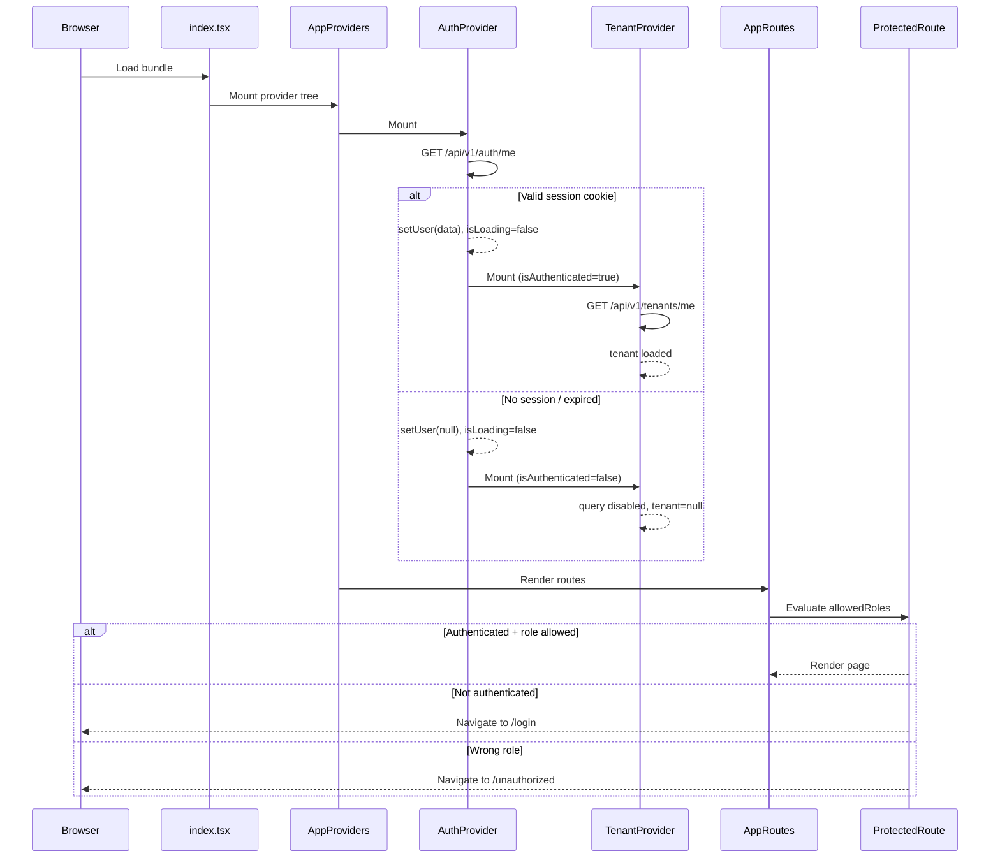

# Secom Frontend — Architecture Overview
## Part 2: Dependency Analysis, Bootstrap & Lifecycle, Build & Environment

---

## 4. Dependency Analysis

### 4.1 Production Dependencies

| Package | Version | Purpose | Status | Notes |
|---|---|---|---|---|
| `react` | ^18.2.0 | UI framework | ✅ Current | |
| `react-dom` | ^18.2.0 | DOM renderer | ✅ Current | |
| `react-router-dom` | ^6.30.1 | Client-side routing | ✅ Current | |
| `@tanstack/react-query` | ^5.89.0 | Server state management | ✅ Current | v5 API (no `cacheTime`, uses `gcTime`) |
| `zustand` | ^4.5.7 | Client state | ✅ Current | |
| `framer-motion` | ^12.37.0 | Animation | ✅ Current | 🟨 Used only in `TopLoadingBar` — high bundle cost for limited use |
| `react-icons` | ^5.6.0 | Icon set | ✅ Current | |
| `react-hot-toast` | ^2.6.0 | Toast notifications | 🟧 Unused | **Never imported in source code.** Custom `toastStore` + `ToastContainer` is used instead. Dead dependency. |
| `@vsaas/types` | file:packages/types | Shared types + RBAC | ✅ Local | Workspace package; no versioning risk |

### 4.2 Development Dependencies

| Package | Version | Purpose | Status | Notes |
|---|---|---|---|---|
| `vite` | ^5.4.11 | Build tool | ✅ Current | |
| `typescript` | ^5.7.3 | Type system | ✅ Current | |
| `@vitejs/plugin-react` | ^4.3.4 | React Babel transform for Vite | ✅ Current | |
| `vitest` | ^2.0.0 | Unit test runner | ✅ Current | |
| `@vitest/coverage-v8` | ^2.0.0 | Coverage via V8 | ✅ Current | |
| `@testing-library/react` | ^16.3.0 | Component testing | ✅ Current | |
| `@testing-library/jest-dom` | ^6.8.0 | DOM matchers | ✅ Current | |
| `@testing-library/user-event` | ^14.6.1 | User interaction simulation | ✅ Current | |
| `@testing-library/dom` | ^10.4.1 | DOM testing utilities | ✅ Current | |
| `@tanstack/react-query-devtools` | ^5.89.0 | Query inspector | ✅ Current | Dev only; not rendered in production |
| `cypress` | ^15.1.0 | E2E testing | ✅ Current | |
| `eslint` | ^9.39.4 | Linting | ✅ Current | Flat config format |
| `@typescript-eslint/eslint-plugin` | ^8.57.0 | TS-specific lint rules | ✅ Current | |
| `eslint-plugin-react` | ^7.37.5 | React lint rules | ✅ Current | |
| `eslint-plugin-react-hooks` | ^7.0.1 | Hooks lint rules | ✅ Current | |
| `prettier` | ^3.6.2 | Code formatting | ✅ Current | |
| `husky` | ^9.1.7 | Git hooks | ✅ Current | |
| `lint-staged` | ^16.2.3 | Staged file processing | ✅ Current | |
| `jsdom` | ^25.0.0 | DOM environment for Vitest | ✅ Current | |
| `@faker-js/faker` | ^8.4.1 | Test data generation | ✅ Current | |
| `concurrently` | ^9.2.0 | Parallel process runner | ✅ Current | |
| `wait-on` | ^8.0.0 | Process readiness waiting | ✅ Current | Used in CI for E2E |
| `globals` | ^15.15.0 | ESLint global definitions | ✅ Current | |
| `@types/node` | ^24.6.0 | Node.js type definitions | ✅ Current | |
| `@types/react` | ^18.2.39 | React type definitions | ✅ Current | |
| `@types/react-dom` | ^18.2.17 | ReactDOM type definitions | ✅ Current | |

### 4.3 Dependency Risks & Observations

**🟧 High — Unused production dependency**

`react-hot-toast` is declared in `dependencies` (not `devDependencies`) but is never imported anywhere in the source tree. It will be included in the production bundle unless tree-shaking eliminates it entirely. Even if tree-shaken, it creates confusion about the intended notification strategy and adds a transitive dependency surface.

**🟨 Medium — Disproportionate bundle cost for framer-motion**

`framer-motion` (^12.x) is a large animation library (~100KB gzipped). Its only usage in this codebase is the `TopLoadingBar` component, which uses `AnimatePresence` and `motion.div` for a simple progress bar animation. The same effect could be achieved with a CSS animation, eliminating this dependency entirely.

**🟩 Low — No schema validation library**

Form validation is implemented as plain imperative functions (e.g., `if (form.title.length < 5) e.title = ...`). There is no Zod, Yup, or Valibot. This is not a security risk (validation is also enforced server-side), but it limits reusability, composability, and the ability to derive TypeScript types from schemas.

**🟩 Low — No error monitoring integration**

There is no Sentry, Datadog, or equivalent error reporting SDK. The `ErrorBoundary` logs to `console.error` only. Production errors are invisible unless the user reports them.

**🟩 Low — No date library**

Date formatting uses `new Date().toLocaleDateString('pt-BR')` and `toLocaleString('pt-BR')` inline throughout page components. This is functional but inconsistent and not timezone-aware. A lightweight library (e.g., `date-fns`) would centralize date formatting.

### 4.4 Bundle Chunking Strategy

Vite's `rollupOptions.manualChunks` in `vite.config.ts` defines four explicit chunks:

| Chunk | Contents |
|---|---|
| `vendor` | `react`, `react-dom`, `react-router-dom` |
| `query` | `@tanstack/react-query` |
| `motion` | `framer-motion` |
| `icons` | `react-icons` |

All page components are lazy-loaded via `React.lazy()`, creating additional async chunks per route. This is a sound strategy: the initial bundle is small, and domain module code is only loaded when the user navigates to that route.

---

## 5. Application Bootstrap & Runtime Lifecycle

### 5.1 Provider Hierarchy

```
index.tsx
└── React.StrictMode
    └── App
        ├── ErrorBoundary                    (class component, catches render errors)
        └── AppProviders
            ├── QueryProvider                (QueryClientProvider — must be outermost)
            │   └── BrowserRouter            (must wrap AuthProvider for useNavigate)
            │       └── AuthProvider         (Context: user, login, logout, refreshUser)
            │           └── CitizenAuthProvider  (Context: citizen, independent of tenant)
            │               └── TenantProvider   (depends on AuthProvider via useAuth)
            │                   └── [children]
            │                       ├── <a href="#main-content"> (skip link)
            │                       ├── TopLoadingBar
            │                       ├── ScrollToTop
            │                       ├── ConnectionBanner
            │                       ├── AppRoutes
            │                       ├── CookieConsent
            │                       └── ToastContainer
```

The ordering constraints are documented in `AppProviders.tsx` comments:
1. `QueryProvider` must be outermost — both `AuthProvider` and `TenantProvider` use TanStack Query internally.
2. `BrowserRouter` must wrap `AuthProvider` — `AuthProvider` calls `useNavigate()` on logout.
3. `AuthProvider` must wrap `TenantProvider` — `TenantProvider` calls `useAuth()` on mount.
4. `CitizenAuthProvider` is independent of `TenantProvider`.

`TenantProvider` includes a DEV-mode guard that throws if rendered outside `AuthProvider`, preventing silent misconfiguration.

### 5.2 Authentication Initialization

Both `AuthProvider` and `CitizenAuthProvider` follow the same initialization pattern:

```
mount
  └── useEffect → refreshUser() / refreshCitizen()
        ├── success → setUser(res.data) / setCitizen(res.data)
        └── failure → setUser(null) / setCitizen(null)
        └── finally → setIsLoading(false)
```

During the `isLoading: true` phase, `ProtectedRoute` renders a spinner rather than redirecting. This prevents a flash-redirect to `/login` on page refresh when the user has a valid session cookie.

### 5.3 Tenant Initialization

`TenantProvider` uses a TanStack Query `useQuery` (key: `['tenant', 'me']`) to fetch tenant data. The query is:
- **Enabled only when** `isAuthenticated && !!user?.tenantId` — prevents unnecessary requests for unauthenticated users.
- **`staleTime: 5 minutes`** — tenant data is considered fresh for 5 minutes.
- **`retry: false`** — tenant fetch failures are not retried (avoids hammering the API on auth errors).

### 5.4 Route Registration

All routes are defined in a single file: `src/routes/index.tsx`. Routes are organized into three `<Route>` groups, each with a layout shell as the parent element:

```
AppRoutes
├── <PublicLayout>          /  /privacy  /terms  /login  /register
│                           /accept-invite  /forgot-password  /reset-password
│
├── <ProtectedRoute allowedRoles={STAFF_ROLES}>
│   └── <DashboardLayout>   /admin/dashboard  /admin/users  /settings/profile
│                           /press-releases  /media-contacts  /clippings
│                           /events  /appointments  /citizen-portal  /social-media
│
└── <CitizenPortalLayout>   /portal  /portal/login  /portal/register
                            /portal/dashboard (ProtectedCitizenRoute)
                            /portal/profile   (ProtectedCitizenRoute)
```

Every page component is wrapped in `React.lazy()` + `<Suspense fallback={<LoadingScreen />}>`.

### 5.5 Global UI Components

Components rendered outside the route tree (always present):

| Component | Purpose |
|---|---|
| `ErrorBoundary` | Catches render errors in the entire app tree |
| `TopLoadingBar` | Animated bar visible during navigation and any active React Query fetch |
| `ScrollToTop` | Scrolls to top on route change |
| `ConnectionBanner` | Polls `/api/v1/health` every 30s; shows banner if API is unreachable |
| `CookieConsent` | LGPD cookie consent banner (localStorage-persisted) |
| `ToastContainer` | Renders active toasts from `useToastStore` |

### 5.6 Bootstrap Flow Diagram



---

## 6. Build & Environment Configuration

### 6.1 Environment Variables

| Variable | Required | Default | Purpose |
|---|---|---|---|
| `VITE_API_URL` | Yes | — | Backend API base URL |
| `VITE_APP_ENV` | No | `development` | Environment label (`development` \| `staging` \| `production`) |

`src/config/env.ts` validates `VITE_API_URL` at startup and throws a descriptive error if it is missing (except in `test` mode, where it falls back to `http://localhost:5000`). This is a good practice that prevents silent misconfiguration.

Only two environment variables are consumed by the frontend. There are no feature flags, tenant-specific overrides, or analytics keys in the current configuration.

### 6.2 Environment Separation

| Environment | Config file | API URL source |
|---|---|---|
| Development | `.env` (gitignored) | `VITE_API_URL=http://localhost:5000` |
| Test (Vitest) | `vite.config.ts` `test.env` | `VITE_API_URL=http://localhost:5000` |
| CI / Production build | GitHub Actions `env:` block | `VITE_API_URL=https://api.placeholder.example` |
| Staging | `.env.staging` (backend only) | Not defined for frontend |

There is no `.env.staging` or `.env.production` file for the frontend. Environment-specific API URLs are injected at build time via CI environment variables. This is correct for a Vite application (all `VITE_*` variables are inlined at build time), but it means there is no local way to simulate a staging build without manually setting environment variables.

### 6.3 Vite Build Configuration

```typescript
// vite.config.ts (summarized)
{
  plugins: [react()],                          // Babel-based React transform
  resolve: {
    alias: { '@': './src', '@vsaas/types': './packages/types/src/index.ts' }
  },
  server: {
    port: 3000,
    proxy: { '/api': { target: 'http://localhost:5000', changeOrigin: true } }
  },
  build: {
    sourcemap: 'hidden',                       // Source maps generated but not served publicly
    rollupOptions: {
      output: {
        manualChunks: {
          vendor: ['react', 'react-dom', 'react-router-dom'],
          query:  ['@tanstack/react-query'],
          motion: ['framer-motion'],
          icons:  ['react-icons'],
        }
      }
    }
  }
}
```

Key observations:

- **`sourcemap: 'hidden'`** — source maps are generated but not referenced in the bundle. This is the correct production setting: maps are available for error monitoring tools but not exposed to end users.
- **Dev proxy** — `/api` requests in development are proxied to `localhost:5000`, avoiding CORS issues without requiring backend CORS configuration for local development.
- **No `base` path configured** — the app assumes it is served from the root path `/`. Deploying to a sub-path would require adding `base: '/secom/'` (or equivalent).
- **Vitest configuration is co-located in `vite.config.ts`** — this is the standard Vitest pattern and avoids a separate config file.

### 6.4 CI Pipeline

The GitHub Actions workflow (`ci.yml`) runs on push/PR to `main` and `develop`:

```
1. Secret scanning (Gitleaks)
2. Install packages/types + build
3. Install frontend deps (npm ci)
4. Install backend deps (npm ci)
5. Type check (tsc --noEmit, both frontend and backend)
6. Lint (eslint, both frontend and backend)
7. Frontend unit tests (vitest run)
8. Frontend production build
9. Backend tests (jest)
10. E2E tests (Cypress — press-releases spec only)
```

**Observations:**
- 🟩 Secret scanning with Gitleaks is a strong security practice at the CI level.
- 🟨 Only one Cypress spec (`press-releases.cy.ts`) runs in CI. The `authentication.cy.ts` spec exists but is not included in the CI `--spec` filter.
- 🟩 The pre-commit hook (`husky`) runs `type-check` and `lint` before every commit, providing a fast feedback loop.
- 🟨 There is no coverage threshold enforcement. `vitest run --coverage` is available as a script but not run in CI.
- 🟩 The build step in CI uses a real `VITE_API_URL`, confirming the build does not silently succeed with a missing required variable.

### 6.5 Architectural Implications of Build Setup

The current setup is appropriate for a single-tenant deployment where the API URL is known at build time. If the system needs to support **runtime-configurable API URLs** (e.g., white-label deployments or dynamic tenant routing), the current approach of inlining `VITE_API_URL` at build time would require either:
- A separate build per environment, or
- Switching to a runtime configuration approach (e.g., a `/config.json` fetched at startup).

This is not a current requirement but is worth noting given the multi-tenant nature of the vSaaS boilerplate.
