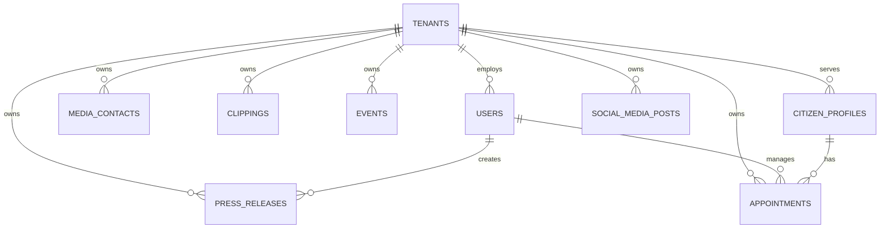

# Secom Backend — Comprehensive Modular Review

## Overview

This document contains **8 specialized prompts** for a comprehensive backend analysis of the Secom system. Each prompt focuses on a specific aspect and can be used independently or as a complete review sequence.

**Project Context**: Secom is a communication management system for the Secretaria de Comunicação managing:
- **Modules**: Press releases, media contacts, clipping, events, appointments, citizen portal, social media
- **Roles**: admin, assessor, social_media, atendente, citizen
- **Stack**: Node.js, Express, TypeScript, MongoDB 8, Redis 7, BullMQ
- **Architecture**: Modular monolith with domain-driven organization, multi-tenancy, RBAC

---

## PROMPT 1: Architecture & Technology Stack

### Objective
Document the Secom backend technology stack and overall architecture.

### Tasks

#### 1. Technology Stack Inventory
Document all technologies:
- **Language & Runtime**: Node.js version, TypeScript configuration
- **Framework**: Express.js, middleware stack
- **Database**: MongoDB 8, Mongoose ODM
- **Caching**: Redis 7
- **Background Jobs**: BullMQ workers and queues
- **Authentication**: JWT with httpOnly cookies
- **Authorization**: RBAC (admin, assessor, social_media, atendente, citizen)
- **Email**: Email service integration
- **Testing**: Jest, test database setup
- **Documentation**: Swagger/OpenAPI
- **Infrastructure**: Docker Compose, GitHub Actions CI

**Deliverable**: Complete technology stack table

#### 2. Project Structure Analysis
```
backend/
├── src/
│   ├── modules/                    # Secom domain modules
│   │   ├── press-releases/
│   │   ├── media-contacts/
│   │   ├── clipping/
│   │   ├── events/
│   │   ├── appointments/
│   │   ├── citizen-portal/
│   │   └── social-media/
│   ├── controllers/
│   ├── services/
│   ├── models/
│   ├── middleware/
│   ├── routes/
│   ├── validation/
│   ├── config/
│   ├── utils/
│   ├── types/
│   ├── platform/
│   └── queues/
├── tests/
├── migrations/
├── scripts/
└── seeds/
```

Document per directory: file count, naming conventions, responsibility, organization pattern, average LOC, largest files.

**Deliverable**: Project structure documentation with statistics

#### 3. Dependency Analysis
| Package | Version | Purpose | Security Issues | Outdated | Replacement Options |
|---------|---------|---------|-----------------|----------|---------------------|

Identify:
- 🟥 Security vulnerabilities
- 🟧 Outdated packages (>2 major versions)
- 🟨 Unused dependencies
- 🟩 Optimization opportunities

#### 4. Application Bootstrap
Analyze `server.ts`, `app.ts`:
- Server initialization
- Middleware stack and ordering
- Route registration for all 7 Secom modules
- MongoDB connection lifecycle
- Redis connection lifecycle
- BullMQ worker initialization
- Tenant initialization
- Error handling setup
- Graceful shutdown handling

#### 5. Configuration Management
Document:
- Environment variables (from `.env.example`)
- Environment separation (dev / staging / prod)
- Secrets management approach
- Tenant-specific configuration
- Module-specific configuration

#### 6. Architecture Pattern
Identify:
- Architecture style: modular monolith with domain-driven organization
- Design patterns: Repository, Service Layer, Middleware, Factory
- Multi-tenancy implementation
- RBAC enforcement patterns
- Module communication patterns

### Output Document
**File**: `docs/architecture/backend/overview.md`

---

## PROMPT 2: MongoDB Architecture & Data Models

### Objective
Comprehensive analysis of the Secom MongoDB schema, data models, and relationships.

### Tasks

#### 1. Collection Inventory
| Collection | Approx. Documents | Avg Document Size | Index Count | Validation Rules | Purpose |
|------------|-------------------|-------------------|-------------|------------------|---------|
| users | | | | | User accounts with RBAC roles |
| press-releases | | | | | Press release management |
| media-contacts | | | | | Journalist and media outlet contacts |
| clippings | | | | | Media monitoring records |
| events | | | | | Public and institutional events |
| appointments | | | | | Citizen service appointments |
| citizen-profiles | | | | | Citizen portal profiles |
| social-media-posts | | | | | Social media content |
| tenants | | | | | Multi-tenancy configuration |

#### 2. Entity Relationship Diagram


#### 3. Data Model Deep Dive
For each major entity document: fields, types, required/optional, indexes, relationships, business rules.

#### 4. Index & Query Performance Analysis
| Collection | Index Name | Fields | Type | Unique | Usage | Issues |

Analyze: missing indexes, compound index ordering, over-indexing, tenant-scoped indexes.

#### 5. Data Integrity Analysis
- Tenant isolation enforcement
- Soft delete implementation
- Referential integrity
- Orphaned document risks

### Output Document
**File**: `docs/architecture/backend/mongodb-architecture.md`

---

## PROMPT 3: API Design & Endpoints

### Objective
Comprehensive analysis of the Secom API design and all endpoints.

### Tasks

#### 1. Complete API Endpoint Inventory
| Method | Endpoint | Controller | Handler | Auth | Roles | Request Body | Response | Status Codes |
|--------|----------|------------|---------|------|-------|--------------|----------|--------------|
| POST | /api/v1/auth/login | AuthController | login | No | Public | {email, password} | {token, user} | 200, 400, 401 |
| GET | /api/v1/press-releases | PressReleaseController | list | Yes | admin, assessor | Query params | PressRelease[] | 200, 401, 403 |
| POST | /api/v1/press-releases | PressReleaseController | create | Yes | admin, assessor | PressRelease data | PressRelease | 201, 400, 401, 403 |
| GET | /api/v1/media-contacts | MediaContactController | list | Yes | admin, assessor | Query params | MediaContact[] | 200, 401, 403 |
| GET | /api/v1/clipping | ClippingController | list | Yes | admin, assessor | Query params | Clipping[] | 200, 401, 403 |
| GET | /api/v1/events | EventController | list | Yes | admin, assessor | Query params | Event[] | 200, 401, 403 |
| GET | /api/v1/appointments | AppointmentController | list | Yes | admin, atendente | Query params | Appointment[] | 200, 401, 403 |
| GET | /api/v1/citizen-portal | CitizenPortalController | list | Yes | admin, atendente, citizen | Query params | CitizenProfile[] | 200, 401, 403 |
| GET | /api/v1/social-media | SocialMediaController | list | Yes | admin, social_media | Query params | SocialMediaPost[] | 200, 401, 403 |
| [Continue for all endpoints...] |

#### 2. RESTful Design Evaluation
Evaluate against REST principles for all 7 Secom module routes.

#### 3. Request/Response Pattern Analysis
Standard success response:
```json
{ "success": true, "data": {...}, "meta": {...} }
```

Standard error response:
```json
{ "success": false, "error": { "code": "VALIDATION_ERROR", "message": "...", "details": [...] } }
```

#### 4. Pagination, Filtering & Sorting
Evaluate consistency across all Secom module list endpoints.

#### 5. API Versioning Strategy
Document `/api/v1/` prefix usage and versioning approach.

### Output Document
**File**: `docs/architecture/backend/api-design.md`

---

## PROMPT 4: Authentication, Authorization & Security

### Objective
Comprehensive analysis of Secom authentication, RBAC, and security practices.

### Tasks

#### 1. Authentication Mechanism
- JWT with httpOnly cookies
- Access vs Refresh token model
- Token expiration strategy
- Revocation mechanism

#### 2. Authorization & RBAC Analysis

**Secom Role Hierarchy**:
```
admin (full system access)
  ├─ assessor (press releases, media contacts, clipping)
  ├─ social_media (social media module)
  ├─ atendente (appointments, citizen service)
  └─ citizen (citizen portal only)
```

**Role-Permission Matrix**:
| Permission | admin | assessor | social_media | atendente | citizen |
|------------|-------|----------|--------------|-----------|---------|
| press-releases.create | ✓ | ✓ | ✗ | ✗ | ✗ |
| press-releases.approve | ✓ | ✓ | ✗ | ✗ | ✗ |
| press-releases.publish | ✓ | ✓ | ✗ | ✗ | ✗ |
| media-contacts.manage | ✓ | ✓ | ✗ | ✗ | ✗ |
| clipping.view | ✓ | ✓ | ✗ | ✗ | ✗ |
| events.manage | ✓ | ✓ | ✗ | ✗ | ✗ |
| appointments.manage | ✓ | ✗ | ✗ | ✓ | ✗ |
| citizen-portal.manage | ✓ | ✗ | ✗ | ✓ | Own only |
| social-media.manage | ✓ | ✗ | ✓ | ✗ | ✗ |

#### 3. Security Best Practices Audit
- Input validation (MongoDB injection prevention)
- HTTPS enforcement
- CORS configuration
- Security headers
- Rate limiting
- LGPD compliance

#### 4. Sensitive Data Protection
- Government communications data handling
- Citizen PII protection
- Encryption at rest and in transit
- LGPD compliance posture

### Output Document
**File**: `docs/architecture/backend/auth-security.md`

---

## PROMPT 5: Business Logic & Service Layer

### Objective
Comprehensive analysis of Secom business logic implementation and service layer architecture.

### Tasks

#### 1. Service Layer Architecture
Document services for each Secom module:
- PressReleaseService
- MediaContactService
- ClippingService
- EventService
- AppointmentService
- CitizenPortalService
- SocialMediaService
- AuthService
- TenantService
- NotificationService

#### 2. Business Logic Inventory

**Domain: Press Release Management**
- Status workflow: draft → pending-approval → approved → published
- Approval process and role enforcement
- Publication scheduling
- Audit trail

**Domain: Appointment Management**
- Appointment booking and conflict prevention
- Citizen assignment to atendente
- Status workflow: scheduled → confirmed → completed / cancelled
- Cancellation rules

**Domain: Citizen Portal**
- Citizen profile creation and management
- Self-service access controls
- Privacy settings

**Domain: Social Media**
- Content scheduling across platforms
- Multi-platform publishing
- Status workflow: draft → scheduled → published

#### 3. Business Rule Inventory
| Rule ID | Description | Enforcement Layer | Consistent? | Can Be Bypassed? | Risk Level |
|---------|-------------|-------------------|-------------|------------------|------------|
| BR-001 | Press release requires approval before publishing | Service layer | ? | ? | High |
| BR-002 | Appointment conflict prevention | Service layer | ? | ? | High |
| BR-003 | Citizen can only access own portal data | Auth middleware + service | ? | ? | Critical |
| BR-004 | Tenant data isolation | Mongoose query scoping | ? | ? | Critical |

#### 4. Validation Architecture
- Layer 1: DTO / Request validation
- Layer 2: Business rule validation
- Layer 3: MongoDB schema constraints

#### 5. Transaction & Consistency Strategy
Evaluate multi-document transaction usage for critical Secom workflows.

### Output Document
**File**: `docs/architecture/backend/business-logic.md`

---

## PROMPT 6: Integration & External Services

### Objective
Comprehensive analysis of all Secom external integrations.

### Tasks

#### 1. External Service Inventory
| Service | Purpose | Integration Type | Criticality | Fallback |
|---------|---------|------------------|-------------|----------|
| Email | Transactional emails | REST API / SMTP | Yes | SMTP |
| MailHog | Local email testing | SMTP | Dev only | N/A |
| Redis | Caching + BullMQ | SDK | Yes | None |
| MongoDB | Primary database | SDK | Yes | None |
| File Storage | Document uploads | Local / S3 | Yes | Local |

#### 2. BullMQ Integration
- Job types: email sending, notifications, social media scheduling, report generation
- Worker configuration
- Retry and backoff strategy
- Dead-letter handling
- Job monitoring

#### 3. Email Service Integration
- Template management
- Delivery logging
- Failure handling strategy
- MailHog for local development

#### 4. File Storage Integration
- Upload handling for press release attachments
- Document storage for citizen portal
- Security: private vs public access
- MIME validation and size limits

### Output Document
**File**: `docs/architecture/backend/integrations.md`

---

## PROMPT 7: Performance, Scalability & Infrastructure

### Objective
Analyze Secom backend performance, scalability, and infrastructure maturity.

### Tasks

#### 1. Application Performance Profile
Analyze major endpoints:
- `/api/v1/press-releases` (list, create, approve, publish)
- `/api/v1/appointments` (list, create, conflict check)
- `/api/v1/citizen-portal` (list, profile management)
- `/api/v1/social-media` (list, schedule, publish)
- `/api/v1/auth/login`

#### 2. MongoDB Query & Index Analysis
- Tenant-scoped compound indexes
- Module-specific query patterns
- Aggregation pipeline performance
- Soft-delete filtering cost

#### 3. Redis & Caching Architecture
- Cache hit rate
- TTL discipline
- Multi-tenant key isolation
- BullMQ queue performance

#### 4. Background Job Processing (BullMQ)
- Worker concurrency
- Job retry strategy
- Dead-letter handling
- Queue depth monitoring

#### 5. Scalability Assessment
- Horizontal scaling readiness
- Stateless application design
- Database connection pooling
- Docker Compose configuration

#### 6. Infrastructure Architecture
- Docker Compose setup (MongoDB, Redis, MailHog)
- GitHub Actions CI/CD
- Environment separation (dev / staging / prod)
- Backup strategy

### Output Document
**File**: `docs/architecture/backend/performance-infrastructure.md`

---

## PROMPT 8: Code Quality & Testing

### Objective
Comprehensive analysis of Secom backend code quality and testing coverage.

### Tasks

#### 1. Code Quality Metrics
- Total lines of code
- File size distribution
- Cyclomatic complexity
- Code duplication percentage
- TypeScript strict mode compliance

#### 2. Testing Coverage
| Module | Unit Tests | Integration Tests | Coverage | Critical Gaps |
|--------|-----------|-------------------|----------|---------------|
| Auth | | | | |
| Press Releases | | | | |
| Media Contacts | | | | |
| Clipping | | | | |
| Events | | | | |
| Appointments | | | | |
| Citizen Portal | | | | |
| Social Media | | | | |

#### 3. Critical Path Coverage
Verify coverage for:
- Login & refresh token flow
- Press release approval workflow
- Appointment booking conflict detection
- RBAC enforcement
- Tenant data isolation
- BullMQ job processing

#### 4. TypeScript Quality
- Strict mode configuration
- `any` usage count
- Type coverage percentage
- DTO alignment with schemas

#### 5. Error Handling Consistency
- Global error middleware
- Standardized error envelopes
- Error codes for all Secom modules
- Sensitive data exposure prevention

### Output Documents
**File 1**: `docs/architecture/backend/code-quality.md`
**File 2**: `docs/architecture/backend/testing-strategy.md`

---

## Usage Guide

### Sequential Approach (Recommended)
Use prompts in order 1→8 for complete backend review:
- **Week 1**: Prompts 1–2 (Architecture & Database)
- **Week 2**: Prompts 3–4 (API & Security)
- **Week 3**: Prompts 5–6 (Business Logic & Integrations)
- **Week 4**: Prompts 7–8 (Performance & Quality)

### Targeted Approach
- **Security audit only**: Prompt 4
- **Performance optimization**: Prompt 7
- **Code quality review**: Prompt 8
- **API design review**: Prompt 3

---

## Document Naming Convention

```
docs/architecture/backend/
├── overview.md
├── mongodb-architecture.md
├── api-design.md
├── auth-security.md
├── business-logic.md
├── integrations.md
├── performance-infrastructure.md
├── code-quality.md
└── testing-strategy.md
```

---

## Final Deliverable Checklist

After completing all prompts:

- [ ] 9+ markdown documents
- [ ] MongoDB collection ERD (Mermaid)
- [ ] Integration architecture diagram
- [ ] API endpoint catalog (all 7 modules)
- [ ] Role-permission matrix (5 Secom roles)
- [ ] Business logic documentation (all 7 modules)
- [ ] Security audit report
- [ ] Performance metrics and analysis
- [ ] Test coverage report
- [ ] Prioritized improvement list

---

**Ready to begin? Start with Prompt 1 and provide the backend codebase.**
